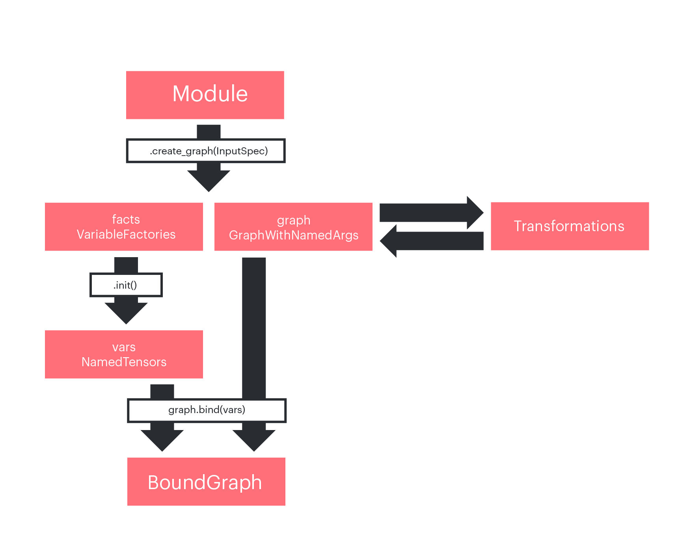
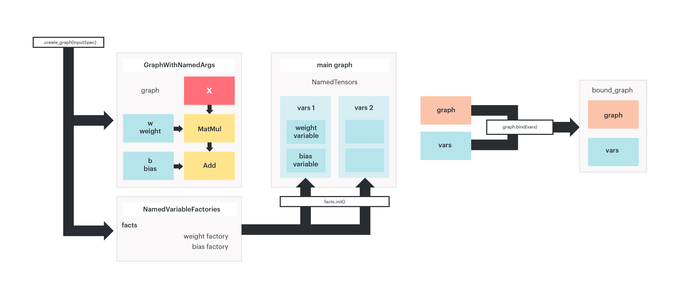

# popxl.addons
`popXL` is an experimental PopART Python module which allows users to hand-craft arbitrary computational graphs, controlling execution and optimisations.
For an introduction to `popXL`, see the official [documentation](https://docs.graphcore.ai/projects/popxl/en/latest/).

We assume you are familiar with the basic `popXL` concepts which are explained in [popXL user guide](https://docs.graphcore.ai/projects/popxl/en/latest/):
- Intermediate representation (IR)
- Tensors (variable, constant and intermediate)
- Graphs (main, parent and subgraphs)
- Input and output streams
- Sessions

We also assume you have completed the [popXL mnist tutorial]().

`popxl.addons` includes common usage patterns of `popXL`, simplifying the process of building and training a model while keeping high control on execution and optimization.

The basic steps needed to build and run a model in `popxl.addons` are the following:

1. Subclass `addons.Module` to create your layers and models in an object-oriented fashion.
2. Initialise an IR as ``ir`` which represents your full compiled program and set the `ir.replication_factor`
3. In the `ir.main_graph()` context, generate the computational graph and the variable factories associated with your module with the `Module` `create_graph` method
4. In the `ir.main_graph()` context, instantiate actual variables with the `NamedVariableFactory` `init` method.
5. In the `ir.main_graph()` context, bind the computational graph to the variables using the `bind` method of ``GraphWithNamedArgs`
6. In the `ir.main_graph()` context,  call the bound graph providing only the inputs.
7. Specify the properties of the IR and create a [session](link to session section) to run your IR.
8. Run the program.

```python
# subclass addons.Module to create your layers and models in an object-oriented fashion.
class myModule(addons.Module):
    def __init__(self, ...):
        super().__init__()
        ...
    def build(self, x: popxl.Tensor) -> popxl.Tensor:
        ...
# initialise an IR which represents your full compiled program and set replication factor
ir = popxl.Ir()
ir.replication_factor = 1
with popxl.main_graph():
    # generate the computational graph and the variable factories
    facts, graph = myModule.create_graph(inputs_tensor_specs)
    # instantiate actual variables
    variables = facts.init()
    # bind the computational graph to the variables
    bound_graph = graph.bind(variables)
    # call the bound graph providing only the inputs
    outputs = bound_graph.call(inputs)
    # the same graph can be bound to different variables,
    # generating a new bound graph
    variables2 = facts.init()
    bound_graph2 = graph.bind(variables)

# Specify the properties of the IR
ir.num_host_transfers = 1
# Create a session to run your IR
session = popxl.Session(ir,'ipu_hw')
# Run the program
session.run(inputs)
```

In this notebook we will go through these steps in detail. We are going to create a simple linear model and train it on the MNIST dataset.

<figure>
    
    <figcaption> <b>Fig 1: </b> Workflow in popxl.addons
 </figcaption>
</figure>

# Basic concepts

To create layers and models you can inherit from the `addons.Module` class.
It allows you to build a **graph** of the computational graph with its own **state**, which means with internal parameters (such as weights).
It is similar to a PyTorch Module or a Keras Layer.

Creating graphs is essential to enable **code reuse**, since you can assemble your program by inserting `call` operations into a subgraph in several places instead of duplicating the nodes at each call site.

```python
class Linear(addons.Module):
    def __init__(self, out_features: int, bias: bool = True):
        super().__init__()
        self.out_features = out_features
        self.bias = bias

    def build(self, x: popxl.Tensor) -> popxl.Tensor:
        # add a state variable to the module
        w = self.add_variable_input("weight", partial(np.random.normal, 0, 0.02, (x.shape[-1], self.out_features)),
                                  x.dtype)
        y = x @ w
        if self.bias:
            # add a state variable to the module
            b = self.add_variable_input("bias", partial(np.zeros, y.shape[-1]), x.dtype)
            y = y + b
        return y
```
Each module implements a `build(self, x: popxl.Tensor) -> popxl.Tensor` method where the graph is defined.
There are two kind of inputs, those provided as arguments of the `build` method (`x` here) and **named inputs**, added via the `add_variable_input` method (`w` and `b` here).

Named inputs are the state variables of the module, its internal parameters.
Remember that in `popXL`, variables can only live in the main graph.
Hence, state tensor variables cannot be instatiated directly in the graph. Their creation needs to take place in the main graph.
The `add_variable_input` method creates a named local placeholder which will be bound to a variable living in the main graph.

The `module.create_graph` method creates the actual graph (a **GraphWithNamedArgs**) and **VariableFactories** for the named inputs.
It requires a `TensorSpec` object or a `Tensor` object for each of the unnamed inputs (`x`).

Once you have the factories you can instantiate actual variables for each of the named inputs by calling `variables = factories.init()` **in the main graph**.

Then, you can bind your graph to these variables with `bound_graph = linear_graph.bind(variables)`.

The resulting **BoundGraph** is effectively a graph with an internal state, which can be called with:
```python
outputs = bound_graph.call(x)
```
The same graph can be bound to different sets of parameters, resulting in different bound graphs :
```python
variables2 = factories.init()
bound_graph2 = linear_graph.bind(variables)
```
However, both bound graphs refer to the same computational graph, hence code is effectively reused.

What actually happens is that
```python
bound_graph.call(input_tensor)
```
becomes a call operation in the main graph with the following arguments:
```python
call(graph, x, inputs_dict=variables_dict)
```
Calling ```bound_graph2```, which is the same graph but bound to different paramaters, results in
```python
call(graph, x, inputs_dict=variables_dict2)
```

<figure>
    
    <figcaption> <b>Fig 2: </b>  The <code>module.create_graph</code> method generates a graph and named variable factories.
        Calling <code>.init()</code> on the variable factories instantiates actual variable tensors in the main graph.
        The same graph can be bound to different sets of variables, generating different bound graphs.
    </figcaption>
</figure>

We now import the necessary packages, including `popxl` and the `popxl.addons`, and write a basic example to illustrate these concepts.


```python
from tqdm import tqdm
import torchvision
import torch
import numpy as np
from typing import Mapping, Optional
from functools import partial
import argparse
import sys

np.random.seed(42)

import popxl.ops as ops
import popxl_addons as addons
import popxl


class Linear(addons.Module):
    def __init__(self, out_features: int, bias: bool = True):
        super().__init__()
        self.out_features = out_features
        self.bias = bias

    def build(self, x: popxl.Tensor) -> popxl.Tensor:
        # add a state variable to the module
        w = self.add_variable_input("weight", partial(np.random.normal, 0, 0.02, (x.shape[-1], self.out_features)),
                                    x.dtype)
        y = x @ w
        if self.bias:
            # add a state variable to the module
            b = self.add_variable_input(
                "bias", partial(np.zeros, y.shape[-1]), x.dtype)
            y = y + b
        return y


ir = popxl.Ir()
main = ir.main_graph
with main:
    # create a graph from the module and named variable factories for each of the named inputs
    facts, linear_graph = Linear(32).create_graph(
        popxl.TensorSpec((2, 4), popxl.float32))
    print("factories: \n", facts)
    print("\n graph: \n", linear_graph.print_schedule())
    # since we are in the main graph, we can instantiate variables using the factories
    variables = facts.init()
    variables2 = facts.init()
    print("\n variables: \n", variables)
    # and bind our graph to these variables that live in the main graph.
    bound_graph = linear_graph.bind(variables)
    bound_graph2 = linear_graph.bind(variables2)
    print("\n two different bound graphs: \n", bound_graph, bound_graph2)

    # the bound graph can be called providing only unnamed inputs x
    input_data = np.asarray(np.random.rand(2, 4)).astype(np.float32)
    input_tensor = popxl.variable(input_data, name="x")

    out = bound_graph.call(input_tensor)
```

    factories: 
     {'weight': <popxl_addons.variable_factory.VariableFactory object at 0x7fca32dd46d8>, 'bias': <popxl_addons.variable_factory.VariableFactory object at 0x7fca32df84e0>}
    
     graph: 
     Graph : Linear_subgraph(0)
      (%1, weight=%2, bias=%3) -> (%5) {
        MatMul.100 (%1 [(2, 4) float32], %2 [(4, 32) float32]) -> (%4 [(2, 32) float32])
        Add.101 (%4 [(2, 32) float32], %3 [(32,) float32]) -> (%5 [(2, 32) float32])
      }
    
     variables: 
     {'bias': Tensor[bias popxl.dtypes.float32 (32,)], 'weight': Tensor[weight popxl.dtypes.float32 (4, 32)]}
    
     two different bound graphs: 
     <popxl_addons.graph.BoundGraph object at 0x7fca32dd4518> <popxl_addons.graph.BoundGraph object at 0x7fca32dd4b00>


# Nested Modules

Modules can be combined and easily nested. Now that we have a `Linear` layer, we can assemble a simple linear model.


```python
class Net(addons.Module):
    def __init__(self, cache: Optional[addons.GraphCache] = None):
        super().__init__(cache=cache)
        self.fc1 = Linear(512)
        self.fc2 = Linear(512)
        self.fc3 = Linear(512)
        self.fc4 = Linear(10)

    def build(self, x: popxl.Tensor):
        x = x.reshape((-1, 28 * 28))
        x = ops.gelu(self.fc1(x))
        x = ops.gelu(self.fc2(x))
        x = ops.gelu(self.fc3(x))
        x = self.fc4(x)
        return x


ir = popxl.Ir()
main = ir.main_graph
with main:
    facts, net_graph = Net().create_graph(popxl.TensorSpec((28, 28), popxl.float32))
    print(facts.to_dict().keys())
    print('\n', net_graph.print_schedule())
```

    dict_keys(['fc1.weight', 'fc1.bias', 'fc2.weight', 'fc2.bias', 'fc3.weight', 'fc3.bias', 'fc4.weight', 'fc4.bias'])
    
     Graph : Net_subgraph(0)
      (%1, fc1.weight=%2, fc1.bias=%3, fc2.weight=%4, fc2.bias=%5, fc3.weight=%6, fc3.bias=%7, fc4.weight=%8, fc4.bias=%9) -> (%21) {
        Reshape.100 (%1 [(28, 28) float32]) -> (%10 [(1, 784) float32])
        MatMul.101 (%10 [(1, 784) float32], %2 [(784, 512) float32]) -> (%11 [(1, 512) float32])
        Add.102 (%11 [(1, 512) float32], %3 [(512,) float32]) -> (%12 [(1, 512) float32])
        Gelu.103 (%12 [(1, 512) float32]) -> (%13 [(1, 512) float32])
        MatMul.104 (%13 [(1, 512) float32], %4 [(512, 512) float32]) -> (%14 [(1, 512) float32])
        Add.105 (%14 [(1, 512) float32], %5 [(512,) float32]) -> (%15 [(1, 512) float32])
        Gelu.106 (%15 [(1, 512) float32]) -> (%16 [(1, 512) float32])
        MatMul.107 (%16 [(1, 512) float32], %6 [(512, 512) float32]) -> (%17 [(1, 512) float32])
        Add.108 (%17 [(1, 512) float32], %7 [(512,) float32]) -> (%18 [(1, 512) float32])
        Gelu.109 (%18 [(1, 512) float32]) -> (%19 [(1, 512) float32])
        MatMul.110 (%19 [(1, 512) float32], %8 [(512, 10) float32]) -> (%20 [(1, 10) float32])
        Add.111 (%20 [(1, 10) float32], %9 [(10,) float32]) -> (%21 [(1, 10) float32])
      }


You can see from the `print_schedule()` output that nested modules result in **inlined** code: the nodes are repeated for each layer, even if they are identical.
For example here `fc2` and `fc3` have the exact same graph.

If you want to achieve better code reuse you can manually **outline** the model by explicitly inserting call operations into the shared graph.
To outline a graph you need to:
- create the graph you want to share: `factories, subgraph= Linear(512).create_graph(x)`
- generate different named input tensors (different local placeholders) for each of the duplicated layers. You can use the `module.add_variable_inputs(name, factories)` method. In this way you create different **local** tensors.
- bind the graph to the local tensors
- add call operations to the bound graphs

To outline a subgraph you need to generate different named input tensors (different local placeholders) for each of the duplicated layers.
In this example, we need different variables for `fc2` and `fc3`.
The `module.add_variable_inputs(name, factories)` method can be used for this purpose.
It produces different local named tensors (`named_tensors_0`and `named_tensors_1` in the example below) that you can use to create two different bound graphs, each bound to its own set of variables.
Once you have the bound graphs you can call each of them.

When you call `facories.init()` in the main context you generate variables for all the local tensors, including `named_tensors_0` and `named_tensors_1`.
When you finally bind the graph, the local tensors are bound to the main variables. Since the subgraph is bound to the local tensors, it is effectively bound to them too.

Below is an outlined version of the network. You can see in the graph that the `fc2` and `fc3` blocks have been replaced by `call` operations.


```python
class NetOutlined(addons.Module):
    def __init__(self, cache: Optional[addons.GraphCache] = None):
        super().__init__(cache=cache)
        # first and last layer are not reused
        self.fc1 = Linear(512)
        self.fc4 = Linear(10)

    def build(self, x: popxl.Tensor):
        x = x.reshape((-1, 28 * 28))
        x = ops.gelu(self.fc1(x))

        # create a single subgraph to be used both for fc2 and fc3
        # create variable factories and subgraph
        facts, subgraph = Linear(512).create_graph(x)
        # generate specific named inputs for fc2
        named_tensors_0 = self.add_variable_inputs("fc2", facts)
        # fc2 is a bound graph using the shared, single subgraph and custom params
        fc2 = subgraph.bind(named_tensors_0)
        # generate specific named inputs for fc3
        named_tensors_1 = self.add_variable_inputs("fc3", facts)
        # fc3 is a bound graph using the shared, single subgraph and custom params
        fc3 = subgraph.bind(named_tensors_1)

        x, = fc2.call(x)
        x = ops.gelu(x)
        x, = fc3.call(x)
        x = ops.gelu(x)

        x = self.fc4(x)
        return x


ir = popxl.Ir()
with ir.main_graph:
    args, net_graph = NetOutlined().create_graph(
        popxl.TensorSpec((28, 28), popxl.float32))
    print(args.to_dict().keys())
    print('\n', net_graph.print_schedule())
```

    dict_keys(['fc1.weight', 'fc1.bias', 'fc4.weight', 'fc4.bias', 'fc2.weight', 'fc2.bias', 'fc3.weight', 'fc3.bias'])
    
     Graph : NetOutlined_subgraph(0)
      (%1, fc1.weight=%2, fc1.bias=%3, fc2.weight=%4, fc2.bias=%5, fc3.weight=%6, fc3.bias=%7, fc4.weight=%8, fc4.bias=%9) -> (%19) {
        Reshape.100 (%1 [(28, 28) float32]) -> (%10 [(1, 784) float32])
        MatMul.101 (%10 [(1, 784) float32], %2 [(784, 512) float32]) -> (%11 [(1, 512) float32])
        Add.102 (%11 [(1, 512) float32], %3 [(512,) float32]) -> (%12 [(1, 512) float32])
        Gelu.103 (%12 [(1, 512) float32]) -> (%13 [(1, 512) float32])
        Call.106(Linear_subgraph(1)) (%13 [(1, 512) float32], %4 [(512, 512) float32], %5 [(512,) float32]) -> (%14 [(1, 512) float32])
        Gelu.107 (%14 [(1, 512) float32]) -> (%15 [(1, 512) float32])
        Call.108(Linear_subgraph(1)) (%15 [(1, 512) float32], %6 [(512, 512) float32], %7 [(512,) float32]) -> (%16 [(1, 512) float32])
        Gelu.109 (%16 [(1, 512) float32]) -> (%17 [(1, 512) float32])
        MatMul.110 (%17 [(1, 512) float32], %8 [(512, 10) float32]) -> (%18 [(1, 10) float32])
        Add.111 (%18 [(1, 10) float32], %9 [(10,) float32]) -> (%19 [(1, 10) float32])
      }


# Load dataset
We are now ready to build the full program to train and validate a linear model on the MNIST dataset.

First of all, we need to load the dataset. We are going to use Pytorch DataLoader.
Data is normalised using the mean and std deviation of the dataset.


```python
def get_mnist_data(test_batch_size: int, batch_size: int):
    training_data = torch.utils.data.DataLoader(torchvision.datasets.MNIST(
        '~/.torch/datasets',
        train=True,
        download=True,
        transform=torchvision.transforms.Compose(
            [
                torchvision.transforms.ToTensor(),
                # mean and std computed on the training set.
                torchvision.transforms.Normalize((0.1307, ), (0.3081, )),
            ])),
        batch_size=batch_size,
        shuffle=True,
        drop_last=True)

    validation_data = torch.utils.data.DataLoader(torchvision.datasets.MNIST(
        '~/.torch/datasets',
        train=False,
        download=True,
        transform=torchvision.transforms.Compose(
            [
                torchvision.transforms.ToTensor(),
                torchvision.transforms.Normalize((0.1307, ), (0.3081, )),
            ]
        )),
        batch_size=test_batch_size,
        shuffle=True,
        drop_last=True)
    return training_data, validation_data
```

# Training

Now that we have a dataset and a model we are ready to construct the training program.

First of all we initialise the [IR](https://docs.graphcore.ai/projects/popxl/en/latest/concepts.html#irs) for the training program.
We also need to specify the `replication_factor` for the IR at the moment of initialisation, before constructing the program, because some operations need to know
the number of IPUs involved.

Inside the main graph context of the IR,
we construct [streams](https://docs.graphcore.ai/projects/popxl/en/latest/op.html#data-input-and-output) to transfer input data from the host to the device
(`popxl.h2d_stream`) and we load data to the device (`popxl.host_load`).

Then, we create two graphs: one for the forward pass and one for the backward pass.
The latter can be obtained from the forward graph applying a **transform**, which is a way of making changes at the graph level.
The `addons.autodiff` transform is the one we need.
It is basically [popxl.autodiff](https://docs.graphcore.ai/projects/popxl/en/latest/transforms.html#autodiff) with some additional patterns.

We instantiate the weights of the network (`variables = facts.init()`), bind the forward graph to these variables and make the call to the forward graph.
We use `call_with_info` because we want to be able to retrieve the activations from the forward graph and pass them to the backward graph (see [calling-a-subgraph](https://docs.graphcore.ai/projects/popxl/en/latest/graph.html#calling-a-subgraph))

We also add the loss with:
```python
loss, dx = addons.ops.cross_entropy_with_grad(x, labels)
```
This operation returns the loss tensor and the gradient to start backpropagation, which is 1 (dl/dl) unless you specify the additional argument `loss_scaling`.

We create an output stream from the device to the host in order to retrieve loss values.

Finally, we call the backward graph and retrieve a dictionary mapping each tensor in the forward graph to its corresponding gradient in the backward graph with:
```python
 grads = bwd_graph.grad_graph_info.fwd_parent_ins_to_grad_parent_outs(fwd_info, bwd_info)
```
This dictionary can then be used by the optimizer to update the weights of the model.

Finally, we setup the properties for `ir`, specifying `num_host_transfers`, and we return a [Session](https://docs.graphcore.ai/projects/popxl/en/latest/session.html) so that we can execute our program.


```python
train_batch_size = 8
test_batch_size = 80
device = "ipu_hw"
lr = 0.05
epochs = 1
```


```python
def train_program(batch_size, device, lr):
    ir = popxl.Ir()
    ir.replication_factor = 1
    with ir.main_graph:
        # Create input streams from host to device
        img_stream = popxl.h2d_stream(
            (batch_size, 28, 28), popxl.float32, "image")
        img_t = ops.host_load(img_stream)  # load data
        label_stream = popxl.h2d_stream((batch_size, ), popxl.int32, "labels")
        labels = ops.host_load(label_stream, "labels")

        # Create forward graph
        facts, fwd_graph = Net().create_graph(img_t)
        # Create backward graph via autodiff transform
        bwd_graph = addons.autodiff(fwd_graph)

        # Initialise variables (weights)
        variables = facts.init()

        # Call the forward graph with call_with_info because we want to retrieve information from the call site
        fwd_info = fwd_graph.bind(variables).call_with_info(img_t)
        x = fwd_info.outputs[0]  # forward output

        # Compute loss and starting gradient for backpropagation
        loss, dx = addons.ops.cross_entropy_with_grad(x, labels)

        # Setup a stream to retrieve loss values from the host
        loss_stream = popxl.d2h_stream(loss.shape, loss.dtype, "loss")
        ops.host_store(loss_stream, loss)

        # retrieve activations from the forward graph
        activations = bwd_graph.grad_graph_info.inputs_dict(fwd_info)
        # call the backward graph providing the starting value for backpropagation and activations
        bwd_info = bwd_graph.call_with_info(dx, args=activations)

        # Optimizer: get a mapping between forward tensors and corresponding gradients and use it to update
        # each tensor
        grads_dict = bwd_graph.grad_graph_info.fwd_parent_ins_to_grad_parent_outs(
            fwd_info, bwd_info)
        for t in variables.tensors:
            ops.scaled_add_(t, grads_dict[t], b=-lr)

    ir.num_host_transfers = 1
    return popxl.Session(ir, device), [img_stream, label_stream], variables, loss_stream


training_data, test_data = get_mnist_data(test_batch_size, train_batch_size)
train_session, train_input_streams, train_variables, loss_stream = train_program(
    train_batch_size, device, lr)

nr_batches = len(training_data)
with train_session:
    for epoch in range(1, epochs + 1):
        print("Epoch {0}/{1}".format(epoch, epochs))
        bar = tqdm(training_data, total=nr_batches)
        for data, labels in bar:
            inputs : Mapping[popxl.HostToDeviceStream, np.ndarray] = dict(zip(train_input_streams,
                                                                            [data.squeeze().float(),
                                                                            labels.int()]))
            loss = train_session.run(inputs)[loss_stream]
            bar.set_description("Loss:{:0.4f}".format(loss))
```

    Epoch 1/1
    Loss:0.0175: 100%|██████████| 7500/7500 [00:20<00:00, 373.74it/s]


After training we retrieve the trained weights to use them during inference and test the accuracy of the model.
To do that, we need to get the data stored in the tensor on the device with `session.get_tensors_data(tensors)`.


```python
# get weights data : dictionary { train_session variables : tensor data (numpy) }
train_vars_to_data = train_session.get_tensors_data(train_variables.tensors)
```

# Testing

To test our model we need to create an inference-only program and run it on the test dataset.
Again, we initialise the IR.
Then, we define the input stream, the graph and the factories for the variables.
We instantiate the variables and bind the graph to them, obtaining our bound graph.
Finally, we call the model. Since this time we do not need to retrieve information from the call site, we can simply use `call` instead of `call_with_info`.
We store the output in an output stream for later use.

One piece is still missing: we need to initialise the model variables with the weights we have just trained.

To do that, once the test_session is created we can call ```test_session.write_variables_data```. This function requires a dictionary ``` tensor_to_be_written : tensor_data_to_write ```. 
It makes a call to ```test_session.write_variable_data(tensor,tensor_data)``` for each tensor in the dictionary and then makes a single host to device transfer at the end to send all data in one go.
In our case, `tensor_to_be_written` need to be the `test_session` variables, and `tensor_data_to_write` need to be the tensor values, given as numpy arrays.

We already have a dictionary between `train_session` variables and their values, the `train_weights_data_dict` retrieved with `train_session.get_tensor_data`.

We need a dictionary between `test_session` variables and `train_session` variables, so that we can create the required `test_variables : test_variables_data` dictionary.

Provided test and training variables are named the same, we can use the `DotTree.to_mapping` function to create this mapping. Given two DotTrees, for common keys this function create a dictionary of their values. So, `train_variables.to_mapping(test_variables)` returns a dictionary ` popxl.Tensor : popxl.Tensor`, where each key-value pair is made of a train variable and the test variable with the same name. 

With these two dictionaries, we can finally build the required `test_variables : test_variables_data` dictionary.
```python
# get weights data : dictionary { train_session variables : tensor data (numpy) }
train_vars_to_data = train_session.get_tensors_data(train_variables.tensors)

# dictionary { train_session variables : test_session variables }
train_vars_to_test_vars = train_variables.to_mapping(test_variables)

# Create a dictionary { test_session variables : tensor data (numpy) }
test_vars_to_data = {
    test_var: train_vars_to_data[train_var].copy()
    for train_var, test_var in train_vars_to_test_vars.items() 
}

# Copy trained weights to the program, with a single host to device transfer at the end
test_session.write_variables_data(test_vars_to_data)
```

We call `.copy` each tensor because `get_tensors_data` returns a memory view of the data, hence they may become invalid if the session is invalidated (or they may change if we do something else later).


```python
'''
Evaluate accuracy from the predictions of the model.
Predictions do not need to be normalized.
'''


def accuracy(predictions: np.ndarray, labels: np.ndarray):
    ind = np.argmax(predictions, axis=-1).flatten()
    labels = labels.detach().numpy().flatten()
    return np.mean(ind == labels) * 100.0


def test_program(test_batch_size, device):
    ir = popxl.Ir()
    ir.replication_factor = 1
    with ir.main_graph:
        # Inputs
        in_stream = popxl.h2d_stream(
            (test_batch_size, 28, 28), popxl.float32, "image")
        in_t = ops.host_load(in_stream)

        # Create graphs
        facts, graph = Net().create_graph(in_t)

        # Initialise variables
        variables = facts.init()

        # Forward
        outputs, = graph.bind(variables).call(in_t)
        out_stream = popxl.d2h_stream(outputs.shape, outputs.dtype, "outputs")
        ops.host_store(out_stream, outputs)

    ir.num_host_transfers = 1
    return popxl.Session(ir, device), [in_stream], variables, out_stream


# Create test program and test session
test_session, test_input_streams, test_variables, out_stream = test_program(test_batch_size,device)

# dictionary { train_session variables : test_session variables }
train_vars_to_test_vars = train_variables.to_mapping(test_variables)

# Create a dictionary { test_session variables : tensor data (numpy) }
test_vars_to_data = {
    test_var: train_vars_to_data[train_var].copy()
    for train_var, test_var in train_vars_to_test_vars.items() 
}    

# Copy trained weights to the program, with a single host to device transfer at the end
test_session.write_variables_data(test_vars_to_data)

# check that weights have been copied correctly
test_vars_to_data_after_write = test_session.get_tensors_data(test_variables.tensors)
for test_var, array in test_vars_to_data_after_write.items():
    assert (array == test_vars_to_data[test_var]).all()

nr_batches = len(test_data)
sum_acc = 0.0
with torch.no_grad(), test_session:
    for data, labels in tqdm(test_data, total=nr_batches):
        inputs : Mapping[popxl.HostToDeviceStream, np.ndarray] = dict(zip(test_input_streams,
                                                                        [data.squeeze().float(),
                                                                         labels.int()]))
        output = test_session.run(inputs)
        sum_acc += accuracy(output[out_stream], labels)
print("Accuracy on test set: {:0.2f}%".format(sum_acc / len(test_data)))
```

    100%|██████████| 125/125 [00:01<00:00, 96.40it/s]Accuracy on test set: 97.14%

