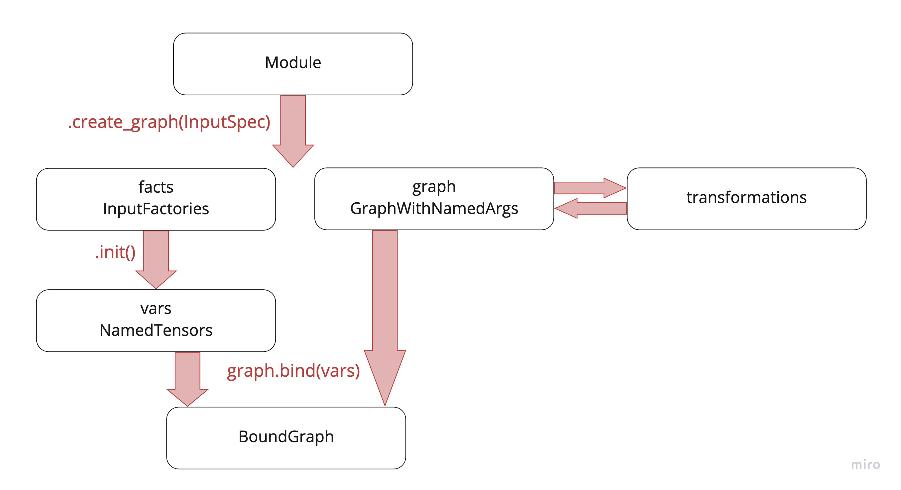
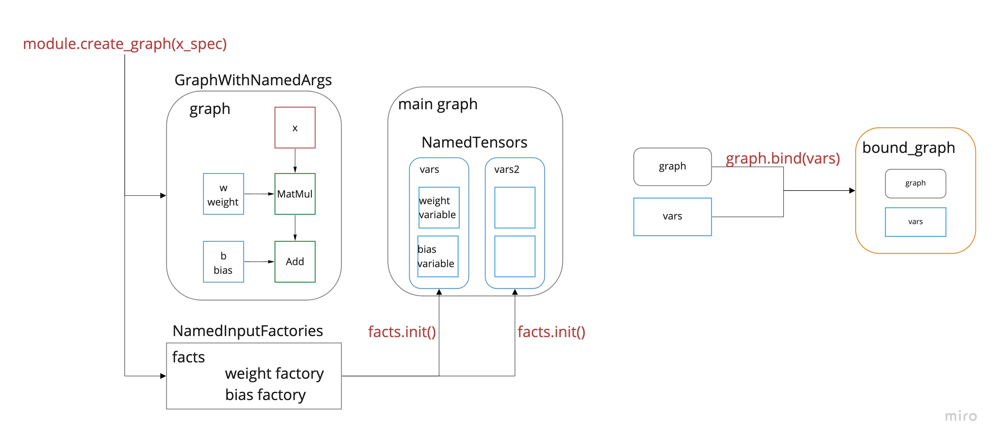

# popxl.addons

popXL allows users to hand-craft arbitrary computational graphs, controlling execution and optimizations. 
For an introduction to popXL, see the official [documentation](https://docs.sourcevertex.net/files/popart-popart-user-guide-latest/popartir.html). 

We assume you are familiar with the basic popxl concepts which are explained in [popXL user guide]():

		- IR
		- Tensors and variable tensors
		- graphs & subgraphs
		- input & output streams
		- Session

We also assume you have followed [popXL mnist tutorial]()

```popxl.addons``` includes common usage patterns of popXL, simplifying the process of building and training a model while keeping high control on execution and optimization. 

The basic steps needed to build and run a model in popxl.addons are the following:

1. subclass ```addons.Module``` to create your layers and models in a object-oriented fashion. 
2. initialize an ir which represents your full compiled program and set the ```ir.replication_factor```
3. in the ```ir.main_graph()``` context, generate the computational graph and the variable factories associated to your module with ```Module``` ```create_graph``` method
4. in the ```ir.main_graph()``` context, instantiate actual variables with ```NamedVariableFactory``` ```init``` method.
5. in the ```ir.main_graph()``` context, bind the computational graph to the variables using the ```bind``` method of ```GraphWithNamedArgs``` 
6. in the ```ir.main_graph()``` context,  call the bound graph providing only the inputs
7. Specify the properties of the ir and create a [session]() to run your ir.
8. Run the program

```python
# subclass ```addons.Module``` to create your layers and models in a object-oriented fashion.
class myModule(addons.Module):
    def __init__(self, ...):
        super().__init__()
        ...
    def build(self, x: popxl.Tensor) -> popxl.Tensor: 
        ...
# initialize an ir which represents your full compiled program and set ir.replication_factor  
ir = popxl.Ir()
ir.replication_factor = 1
with popxl.main_graph():
    # generate the computational graph and the variable factories
    facts, graph = myModule.create_graph(inputs_tensor_specs) 
    # instantiate actual variables
    variables = facts.init()
    # bind the computational graph to the variables
    bound_graph = graph.bind(variables) 

    # call the bound graph providing only the inputs
    outputs = bound_graph.call(inputs) 
    # the same graph can be bound to different variables,
    # generating a new bound graph  
    variables2 = facts.init()
    bound_graph2 = graph.bind(variables) 


# Specify the properties of the ir
ir.num_host_transfers = 1
# Create a session to run your ir
session = popxl.Session(ir,'ipu_hw')
# Run the program
session.run(inputs)
```



In this notebook we will go through these steps in depth. We are going to create a simple linear model and train it on Mnist dataset. 

# Basic concepts
To create layers and models you can inherit from the ```addons.Module``` class. It allows you to build a **graph** of the computational graph with its own **state**, i.e. with internal parameters (such as weights). 
It is similar to a pytorch Module or a Keras Layer.

Making graphs is essential to enable **code reuse**, since you can assemble your program inserting ```call``` operations to a subgraph in several places instead of duplicating the nodes at each call site.

```python
class Linear(addons.Module):
    def __init__(self, out_features: int, bias: bool = True):
        super().__init__()
        self.out_features = out_features
        self.bias = bias

    def build(self, x: popxl.Tensor) -> popxl.Tensor:
        # add a state variable to the module
        w = self.add_variable_input("weight", partial(np.random.normal, 0, 0.02, (x.shape[-1], self.out_features)),
                                  x.dtype)
        y = x @ w
        if self.bias:
            # add a state variable to the module
            b = self.add_variable_input("bias", partial(np.zeros, y.shape[-1]), x.dtype)
            y = y + b
        return y
```
Each module implements a ```build(self, x: popxl.Tensor) -> popxl.Tensor``` method where the graph is defined.
There are two kind of inputs, those provided as arguments of the ```build``` method (```x``` here) and **named inputs**, added via ```add_variable_input``` method (```w``` and ```b``` here).  

Named inputs are the state variables of the module, its internal parameters. 
Remember that in popxl variables can only live in the main graph. Hence, state tensor variables can't be instatiated directly in the graph. Their creation needs to take place in the main graph. The ```add_variable_input``` creates a named local placeholder which will be later bound to a variable in the main graph.

The ```module.create_graph``` method creates the actual graph (a **GraphWithNamedArgs**) and **InputFactories** for the named inputs. It requires a ```TensorSpec``` or a ```Tensor``` for each of the unnamed inputs (```x```).

Once you have the factories you can instantiate actual variables for each of the named inputs by calling ```variables = factories.init()``` **in the main graph**.

Then, you can bind your graph to these variables with ```bound_graph = linear_graph.bind(variables)```.

The resulting **BoundGraph** is effectively a graph with an internal state, which can be called with the familiar api:
```python
outputs = bound_graph.call(x)
```
The same graph can be bound to different set of parameters, resulting in different bound graphs :
```python
variables2 = factories.init()
bound_graph2 = linear_graph.bind(variables)
```
. However, both bound graphs refer to the same computational graph, hence code is effectively reused. 

What actually happens is that the
```
bound_graph.call(input_tensor)
```
becomes a call operation in the main graph with the following arguments
```
call(graph, x, inputs_dict=variables_dict)
```
Calling ```bound_graph2```, which is the same graph but bound to different paramaters, results in
```
call(graph, x, inputs_dict=variables_dict2)
```



# Nested Modules
Modules can be combined and nicely nested. For example you can assemble a simple linear model using several Linear layers.
```python
class Net(addons.Module):
    def __init__(self, cache: Optional[addons.GraphCache] = None):
        super().__init__(cache=cache)
        self.fc1 = Linear(512)
        self.fc2 = Linear(512)
        self.fc3 = Linear(512)
        self.fc4 = Linear(10)

    def build(self, x: popxl.Tensor):
        x = x.reshape((-1, 28 * 28))
        x = ops.gelu(self.fc1(x))
        x = ops.gelu(self.fc2(x))
        x = ops.gelu(self.fc3(x))
        x = self.fc4(x)
        return x
```

````
Graph : Net_subgraph(0)
  (%1, fc1.weight=%2, fc1.bias=%3, fc2.weight=%4, fc2.bias=%5, fc3.weight=%6, fc3.bias=%7, fc4.weight=%8, fc4.bias=%9) -> (%21) {
    Reshape.100 (%1 [(28, 28) float32]) -> (%10 [(1, 784) float32])
    MatMul.101 (%10 [(1, 784) float32], %2 [(784, 512) float32]) -> (%11 [(1, 512) float32])
    Add.102 (%11 [(1, 512) float32], %3 [(512,) float32]) -> (%12 [(1, 512) float32])
    Gelu.103 (%12 [(1, 512) float32]) -> (%13 [(1, 512) float32])
    MatMul.104 (%13 [(1, 512) float32], %4 [(512, 512) float32]) -> (%14 [(1, 512) float32])
    Add.105 (%14 [(1, 512) float32], %5 [(512,) float32]) -> (%15 [(1, 512) float32])
    Gelu.106 (%15 [(1, 512) float32]) -> (%16 [(1, 512) float32])
    MatMul.107 (%16 [(1, 512) float32], %6 [(512, 512) float32]) -> (%17 [(1, 512) float32])
    Add.108 (%17 [(1, 512) float32], %7 [(512,) float32]) -> (%18 [(1, 512) float32])
    Gelu.109 (%18 [(1, 512) float32]) -> (%19 [(1, 512) float32])
    MatMul.110 (%19 [(1, 512) float32], %8 [(512, 10) float32]) -> (%20 [(1, 10) float32])
    Add.111 (%20 [(1, 10) float32], %9 [(10,) float32]) -> (%21 [(1, 10) float32])
  }
````

You can see from the ```print_schedule()``` output that nested modules result in **inlined** code: the nodes are repeated for each layer, even if they are identical. For example here ```fc2``` and ```fc3``` have the exact same graph
```
    MatMul.104 (%13 [(1, 512) float32], %4 [(512, 512) float32]) -> (%14 [(1, 512) float32])
    Add.105 (%14 [(1, 512) float32], %5 [(512,) float32]) -> (%15 [(1, 512) float32])
```

If you want to achieve a better code reuse you can manually **outline** the model by explicitly inserting call operations to the shared graph.
To outline a graph you need to:

- create the graph you want to share ```factories, subgraph= Linear(512).create_graph(x)```
- generate different named input tensors (different local placeholders) for each of the duplicated layers. You can use the ```module.add_variable_inputs(name, factories)``` method. In this way you create different **local** tensors.
- bind the graph to the local tensors
- add call operations to the bound graphs
    
To outline a subgraph you need to generate different named input tensors (different local placeholders) for each of the duplicated layers. In this example, we need different variables for ```fc2``` and ```fc3```. 
The ```module.add_variable_inputs(name, factories)``` method can be used for this purpose. It produces different local named tensors (```named_tensors_0```and ```named_tensors_1``` in the example below) that you can use to create two different bound graph, each bound to its own set of variables. Once you have the bound graphs you can call them.

When you call ``` facories.init()``` in the main context you generate variables for all the local tensors, including ```named_tensors_0``` and ```named_tensors_1```.  
When you finally bind the graph, the local tensors are bound to the main variables. Since the subgraph is bound to the local tensors, it is effectively bound to them too.

Below is an outlined version of the network. You can see in the graph that ```fc2``` and ```fc3``` blocks have been replaced by ```call``` operations.

```python
class NetOutlined(addons.Module):
    def __init__(self, cache: Optional[addons.GraphCache] = None):
        super().__init__(cache=cache)
        #first and last layer are not reused
        self.fc1 = Linear(512) 
        self.fc4 = Linear(10)
        
    def build(self, x: popxl.Tensor):
        x = x.reshape((-1, 28 * 28))
        x = ops.gelu(self.fc1(x))
        
        #create a single subgraph to be used both for fc2 and fc3 
        facts, subgraph = Linear(512).create_graph(x) #create variable factories and subgraph
        named_tensors_0 = self.add_variable_inputs("fc2", facts) # generate specific named inputs for fc2
        fc2 = subgraph.bind(named_tensors_0) #fc2 is a bound graph using the shared, single subgraph and custom params
        named_tensors_1 = self.add_variable_inputs("fc3", facts) # generate specific named inputs for fc3
        fc3 = subgraph.bind(named_tensors_1) #fc3 is a bound graph using the shared, single subgraph and custom params

        x, = fc2.call(x)
        x = ops.gelu(x)
        x, = fc3.call(x)
        x = ops.gelu(x)
        
        x = self.fc4(x)
        return x
```
```
Graph : NetOutlined_subgraph(0)
  (%1, fc1.weight=%2, fc1.bias=%3, fc2.weight=%4, fc2.bias=%5, fc3.weight=%6, fc3.bias=%7, fc4.weight=%8, fc4.bias=%9) -> (%19) {
    Reshape.100 (%1 [(28, 28) float32]) -> (%10 [(1, 784) float32])
    MatMul.101 (%10 [(1, 784) float32], %2 [(784, 512) float32]) -> (%11 [(1, 512) float32])
    Add.102 (%11 [(1, 512) float32], %3 [(512,) float32]) -> (%12 [(1, 512) float32])
    Gelu.103 (%12 [(1, 512) float32]) -> (%13 [(1, 512) float32])
    Call.106 (%13 [(1, 512) float32], %4 [(512, 512) float32], %5 [(512,) float32]) -> (%14 [(1, 512) float32])
    Gelu.107 (%14 [(1, 512) float32]) -> (%15 [(1, 512) float32])
    Call.108 (%15 [(1, 512) float32], %6 [(512, 512) float32], %7 [(512,) float32]) -> (%16 [(1, 512) float32])
    Gelu.109 (%16 [(1, 512) float32]) -> (%17 [(1, 512) float32])
    MatMul.110 (%17 [(1, 512) float32], %8 [(512, 10) float32]) -> (%18 [(1, 10) float32])
    Add.111 (%18 [(1, 10) float32], %9 [(10,) float32]) -> (%19 [(1, 10) float32])
  }
```