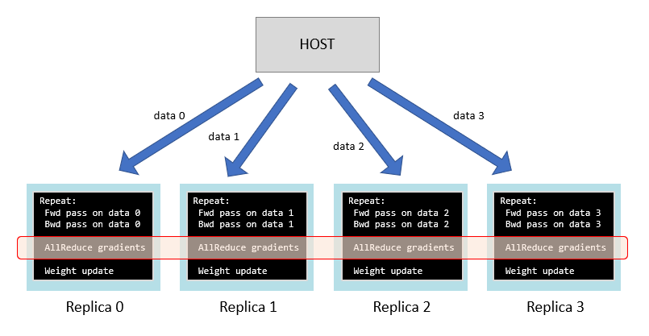
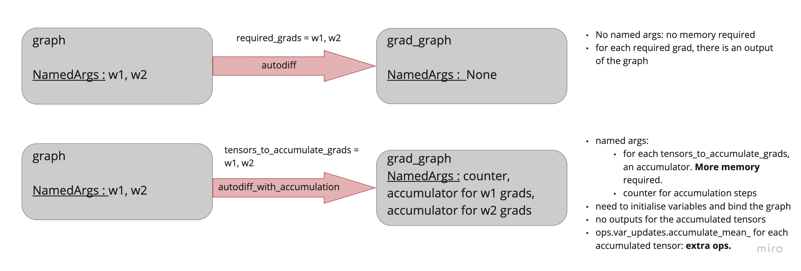
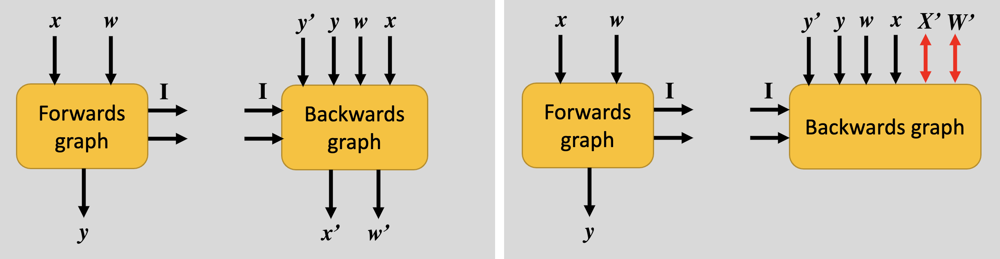

# Data parallelism

Data parallelism techniques are essential to achieve a better throughput during execution.
There are mainly two kind of data parallelism:

- **intra-device data parallelism**. This is controlled by the **micro batch size**. When we use a ```micro_batch_size``` greater than one, the IPU executes the same program in parallel on the different samples of the micro batch. 
- **across-devices data parallelism**. We can also choose to run the same program on different devices, feeding the copies with different data. 
An efficient way to implement this is to use [**replication**](https://docs.graphcore.ai/projects/ipu-programmers-guide/en/latest/algorithmic_techniques.html?highlight=micro%20batch#replication). This executes the same program across multiple devices and provides collective operations for the replicas to communicate. The ```session.ir.replication_factor``` controls the total number of replicas, whatever they are used for (we will see other uses of replication). When using replicas only to implement data parallelism, this factor will be set equal to your ```data_parallel``` factor.

Unless otherwise specified, with the term data parallelism we will always imply data parallelism across different replicas.

## Replication

Each program has an inner execution strategy, which can include multiple devices. 
For example, we can design a program that uses 2 IPUs for its execution.

It's important to understand that replication is always orthogonal to the inner structure of the program: if we choose to run a 2-IPUs program with 4 replicas, we will use ``` 2 * 4 = 8 ``` IPUs, since each replica will need 2 IPUs for its execution.

With data parallelism we can process more data simultaneously, but this comes with an additional **communication** cost.
This communication is achieved by means of **replicated collective operations**. Replicated collective operations perform a tensor operation across replicas, while standard **collective operations** perform tensor operations across devices in a single replica for multi-IPUs programs.

Available collective operations can be found in ```popxl.ops.collectives```. For example, a ```replicated_all_reduce``` op takes a tensor on each replica, calculates the sum (other reduction options are available) across the replicas and then creates a new tensor on each replica holding that sum. An ```all_reduce``` op will do the same, but across IPUs within a single replica.

Without data parallelism, a training step has the form

```shell
repeat:
  # fwd and bwd can happen on multiple IPUs
  calculate forward pass of model on micro_batch to compute loss 
  calculate backward pass of model to compute weight gradients
  update weight using weight gradients
```

With data parallelism the training program has extra collectives operations:

```shell
repeat:
  # fwd and bwd can happen on multiple IPUs
  calculate forward pass of model on micro_batch to compute loss
  calculate backward pass of model to compute weight gradients

  # collectives: extra communication step, extra cost
  obtain sum of gradients across all replicas

  update weight using weight gradients
```

Each model replica will run this program on different `micro-batches`, achieving data-parallelism.


<figcaption><b>Fig 1</b>: Replication during training</figcaption>
<br>
<br>

Sometimes the communication cost can be significant, in which case we may want to amortize it with larger batches. [Gradient accumulation](https://docs.graphcore.ai/projects/ipu-programmers-guide/en/latest/algorithmic_techniques.html?highlight=micro%20batch#gradient-accumulation) can be help in this regard.

## Gradient Accumulation

Up to now we have been updating the weights of the network after each micro batch.
With [Gradient accumulation](https://docs.graphcore.ai/projects/ipu-programmers-guide/en/latest/algorithmic_techniques.html#gradient-accumulation) gradients are instead accumulated for ```N = gradient_accumulation``` micro batches before updating the weights. Accumulation may be summation, mean or running mean.

Without gradient accumulation, a training step has the form
```shell
repeat: #train steps
    load a micro batch 
    # process a micro batch
    calculate forward pass of model on micro batch to get loss 
    calculate backward pass of model to get current weight gradients 
    # if replication
    (obtain sum of gradients across all replicas)
    
    update weight using accumulated weight gradients
```
Each model replica processes ```micro_batch_size ``` samples per weight update.

With gradient accumulation you instead have:

```shell
repeat: #train steps
  zero accumulated weight gradients
  repeat: # gradient accumulation
    load a micro batch 
    # process a micro batch
    calculate forward pass of model on micro batch to get loss 
    calculate backward pass of model to get current weight gradients
    # accumulation step
    add current weight gradients to accumulated weight gradients
  #if replication
  (obtain sum of gradients across all replicas)
  update weight using accumulated weight gradients
```
In this case, each model replica processes ```micro_batch_size * gradient_accumulation``` samples per weight update, but samples are not loaded all at once. Only a ```micro_batch``` is loaded for each gradient accumulation step. This way, we can have larger batches still fitting in the device memory.
For a given number of processed samples, the time cost of the training with or without gradient accumulation is the same: ``` device_time = time_per_sample * micro_batch_size * gradient_accumulation``` (equal if we have smaller ```micro_batches``` with ```gradient_accumulation > 1``` or a single large ```micro_batch``` with ```gradient_accumulation = 1```)

However, from a memory perspective we have an advantage: since we don't have to load the full batch on the device, we can use larger batches and have a better throughput ( large batches are not always a good strategy from a training perspective though).
For this same reason gradient accumulation can be used with data parallelism to amortize the communication cost: if more samples are processed, the communication cost is less relevant.
Another use case for gradient accumulation is pipelining, which will be investigated in another tutorial.

Taking into account both data parallelism and gradient accumulation, the total number of samples that contribute to an optimizer step is

```global_batch_size = micro_batch_size * gradient_accumulation * data_parallel```

## Batch Terminology
- ```micro_batch_size``` size of the micro batch. Determines the data parallelism on a single device and is the number of samples that contribute to a gradient accumulation step.
- ```gradient_accumulation``` number of micro batches processed from a single replica before updating the weights
- ```data_parallel``` number of replicas used to implement data parallelism
- ```global_batch_size``` total number of samples that contributes to a weight update ```global_batch_size = micro_batch_size * gradient_accumulation * data_parallel ```

# Mnist with Gradient Accumulation & Data Parallelism

To add data parallelism to the program we first need to specify a ```ir.replication_factor ``` > 1. Before updating the weights we also have to add communication between replicas via **collective** ops. We can use ``` ops.collectives.replicated_all_reduce_```. Note that if we perform the operation in place, we need to use ```in_sequence(True)``` context.

```python
def train_program(opts):
    ir = popxl.Ir()
    # total number of replicas used in the program, regardeless their use
    # here, we are using them to implement data parallelism, and no other 
    # use of replication is involved.
    ir.replication_factor = opts.train.data_parallel 

    with ir.main_graph:
        ...
            with popxl.in_sequence(True):
            # fwd
            # bwd
            # reduce gradients across replicas
                for g in grads:
                    g = ops.collectives.replicated_all_reduce_(g, op = 'mean')

            # optimizer step
    ...
```

To add also gradient accumulation the first thing to do is using the ```addons.transforms.autodiff_with_accumulation``` transform instead of ```autodiff``` to generate the backward graph.
```python
def autodiff_with_accumulation(
        graph: GraphWithNamedArgs,
        tensors_to_accumulate_grads: Iterable[popxl.Tensor],
        grads_required: Optional[Iterable[popxl.Tensor]] = None) -> Tuple[NamedVariableFactories, GraphWithNamedArgs]
```
While the standard ```autodiff``` transform produces a graph without state, i.e, without variables, the ```autodiff_with_accumulation``` transform generates a graph with state, hence returning both the graph and the variable factories for the ```NamedArgs```, which are the accumulators for the ```tensors_to_accumulate_grads``` and a ```mean_accum_counter``` which is incremented with each call of the gradient graph.  
Each tensor in ```tensors_to_accumulate_grads``` is automatically added as a required grad. You can provide another list of tensors in ```grads_required``` for non-accumulated gradients. 



<figcaption> <b>Fig 2: </b> Differences between <code>autodiff</code> and <code>autodiff_with_accumulation</code>. On the left, <code>autodiff</code> logic. The backward takes as inputs forward activations y, the derivative y', x and w and produces the derivatives x' and w'. On the right,  <code>autodiff_with_accumulation</code>  logic. The backward takes as inputs forward activations y, the derivative y', x, w and the accumulators X' and W'. No output is produced since the result is accumulated in X' and W'. 
</figcaption>
<br>
<br>


<figcaption> <b>Fig 3: </b> <code>autodiff_with_accumulation</code> calls <code>autodiff</code> and then for each tensor in <code>tensors_to_accumulate_grads</code> adds an operation to the output gradient
graph which takes a running mean of the tensor and the result stored in an accumulator tensor. The accumulators are added as NamedArgs TensorByRef inputs to the grad graph and the corresponding output of the original tensor removed.
 </figcaption>
<br>
<br>

After each weight update the running mean needs to be reset. To this aim it's enough to reset the counter with ```ops.var_updates.accumulator_zero_(grad_args.mean_accum_counter)``` after each weight update:

```python
def optimizer_step(...):
    # update variables
        ...
    # Reset accumulators.
    ops.var_updates.accumulator_scale_(grads.mean_accum_counter, 0.0)
```

Finally, note that in a gradient accumulation loop we typically have ```host loads``` in the program:

```shell
for _ in range(gradient_accumulation):
      ...
      input = ops.host_load(input_stream)
      ...
```
Remember from [session user guide]() that

> For each host_load (per tensor) operation in your model to run, you will need to increment the num_host_transfers by one. 

Hence, we will need to set
```
session.ir.num_host_transfers = gradient_accumulation
```
We will also need to provide training data in the appropriate data format when running the session: it should be of shape 
```
(num_host_transfers, replication_factor, *device_shape)
```

In this example we present both techniques. When gradient accumulation is 1, standard autodiff is used to avoid the extra memory from the accumulator variables.