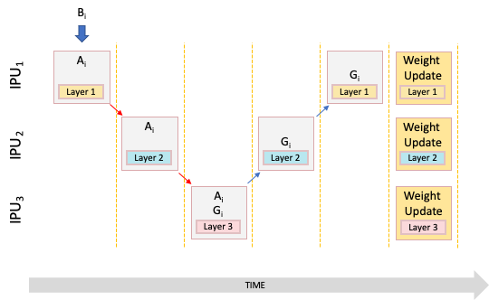
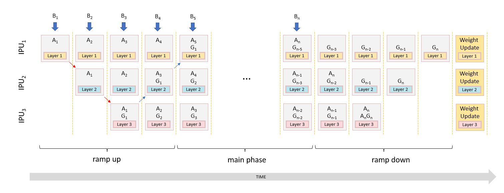
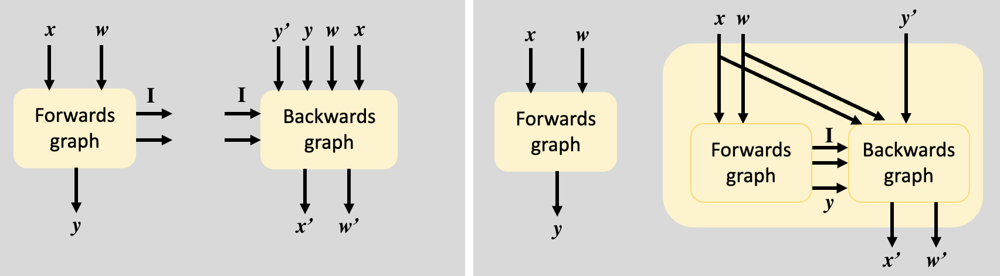

# Pipelining

Up to now, we've run the entire model on a single IPU. This requires
the variables (and other tensors) of all layers to fit within the IPU's memory. However, larger models may exceed the memory capacity on a single IPU.

To train such models while maintaining high IPU utilisation we can use  [**Pipelining**](https://docs.graphcore.ai/projects/ipu-programmers-guide/en/latest/algorithmic_techniques.html?highlight=micro%20batch#model-parallelism-and-pipelining): we first split the model into **independent parts** ( pipeline **stages** ) and then setup the program so that they can be **executed by different IPUs in parallel** (thus, it is a form of **model parallelism**).

Suppose we have a model made of three layers and we define five pipeline stages:
- layer1 forward on IPU0
- layer2 forward on IPU1
- layer3 forward, loss computation, layer3 backward on IPU3
- layer2 backward on IPU1
- layer1 backward on IPU0

If only a batch is processed at each time, the pipeline is very inefficient, because we have a data dependency between the stages and they can't execute in parallel: only one ipu will be active.

- layer1 forward on IPU0
- layer2 forward on IPU1 **data dependecy: needs x = layer1(x)**
- layer3 forward, loss computation, layer3 backward on IPU3 **data dependecy: needs x = layer2(x)**
- layer2 backward on IPU1 **data dependecy: needs dx = dlayer3(dx,activations3)**
- layer1 backward on IPU0 **data dependecy: needs dx = dlayer2(dx,activations2)**


<figcaption> <b>Fig 1: </b> Inefficient pipelining: a single batch B<sub>i</sub> is processed. There is a data dependency hence only one IPU can be active to compute activations A<sub>i</sub> and gradients G<sub>i</sub>.
 </figcaption>

To implement pipelining efficiently, we need to **break the data dependency** by loading multiple micro batches and having each pipeline stage running in parallel on a different micro batch.
Gradient accumulation is perfect here, since we also need to keep the weights of the layers frozen during the whole pipeline execution and update them only at the end. 


 <figcaption> <b>Fig 2: </b> Efficient pipelining: multiple micro batches are loaded using gradient accumulation. Pipeline stages can execute in parallel <b>on different micro batches</b> and all IPUs are used in the main phase when the pipeline is full ( while in the ramp up and ramp down phase only a few are active)
 </figcaption>

## Activation Stash and Recomputation
Note that the gradient computation for a layer requires the layers activations calculated with respect to the same batch. In a pipeline, this computation is separated in time: when the IPU is running the backward for the layer, it has already run `backward_stage - forward_stage` forward steps. Hence we need to save all the forward activations in a FIFO queue of length `backward_stage - forward_stage`, the **activation stash**. This can be inconvenient from a memory perspective. We can instead choose to recompute the activations (all or some) to save memory at the expense of extra computation.
See also the [memory stashes and recomputation](https://docs.graphcore.ai/projects/ipu-programmers-guide/en/latest/algorithmic_techniques.html?highlight=micro%20batch#memory-stashes-and-recomputation) paragraph in the ipu programmer guide.

## Efficient pipelining best practices

- With pipelining, the **`gradient_accumulation`** factor needs to be greater than **2 * number of pipeline stages** (Fig 2 shows it clearly). The greater, the better the IPUs utilisation since in that case ramp up and ramp down phases, when not all IPUs are active, only take a small fraction of the execution.
- To get the best utilisation, the layers across the IPUs should be balanced such that they each take roughly the same amount of time to compute. 
- Forward and backward stages for the same layers should be defined on the same IPU, since they require the same parameters. Moreover, backward requires the layer activations.

# Pipelining in addons

Consider the loop:

```python
for i in range(N):
  x = ops.host_load(h2d_stream)
  x = layer0.call(x) # we want this to be our stage0 on ipu0
  x = x.copy_to_ipu(1)
  x = layer1.call(x) # we want this to be our stage1 on ipu1
  ops.host_store(d2h_stream, x)
```
There is a data dependency between `layer0` -> `layer1`. As explained in the previous section, if we rewrite the program so that `layer0` and `layer1` run on different data, we break the dependency and we are able to execute them in parallel.

```python
# ----------- RAMP UP PHASE - only ipu0 active -----------
#load first batch, batch0
x0 = ops.host_load(h2d_stream) 
# run layer0 on batch0
x0_ = layer0(x0) 
# copy the output of layer0 to ipu1, where layer1 lives. 
x1 = x0_.copy_to_ipu(1)

# ------------- MAIN PHASE: both ipus active --------------
for i in range(N-1):
    # load next batch: x0 = batch1
    x0 = ops.host_load(h2d_stream) 
    # layer0 can run on batch1
    x0_ = layer0(x0) 
    # while layer1 runs on batch0
    x1_ = layer1(x1)
    ops.host_store(d2h_stream, x1_)
    # copy the output of layer0 to ipu1 for next iteration
    x1 = x0_.copy_to_ipu(1)
    
# ----------- RAMP DOWN PHASE - only ipu1 active -----------
x1_ = layer1(x1)
ops.host_store(d2h_stream, x1_)
```

The `addons.pipeline_transform` will transform the first loop into the second one. It adds ramp-up and ramp-down phases and reorders and merges synchronisation, eliminating data dependencies so that stages can be executed in parallel.


## The pipeline transform 
Before implementing a pipeline you should outline the model and create the graphs corresponding to each layer on the ipu you want them to be executed on. You can use `popxl.ipu(ipu_index)` context for that.
Every operation creation must take place in a `ipu` context.

Once you have your layers, you can define a pipeline.
To define a pipeline in addons you need to write your code in the `with addons.pipelined_execution(steps=N) as pipeline` context.
This defines the loop `for i in range(N)` to be transformed. 

Within this context you specify the pipeline stages writing operations inside a `pipeline.stage(stage_index)` context and you decide the ipu where they are executed using `popxl.ipu(ipu_index)` context.
The code snippet below shows a basic pipeline for a two-layers forward.

When the pipeline context closes, the transformation is run and the current graph ends up with a single `ops.call` that executes the pipeline:

There are no constraints on how many or which ipus a stage can run on. However, any communication between ipus will cause a syncronisation that can stall the pipeline. In general, we want the data dependencies between stages to only be represented as `ops.ipu_copy` or `Tensor.copy_to_ipu`.

Being a loop, if you have `host_load` in the pipeline you need to remember to set the `ir.num_host_transfers` property equal to the pipeline steps.

Example below shows a basic pipeline for a 2-layer forward.

```python
import popxl
import popxl_addons as addons
import numpy as np
from functools import partial

class Add(addons.Module):
    def build(self, x: popxl.Tensor):
        w = self.add_variable_input("weight", partial(np.random.normal, 0, 0.02, x.shape), x.dtype)
        x = popxl.ops.add(w, x)
        return x
    
ir = popxl.Ir()
ir.replication_factor = 1
N = 4

with ir.main_graph:
    # inputs
    input_stream = popxl.h2d_stream((32,), dtype = popxl.float32)
    
    # create graphs in the appropriate ipu context
    with popxl.ipu(0):
        facts0, layer0 = Add().create_graph(input_stream.spec)

    with popxl.ipu(1):
        facts1, layer1 = Add().create_graph(input_stream.spec)
    
    # transform the graph if needed 
    
    # bind the graphs when you prefer
    bound_layer0 = layer0.bind(facts0.init())
    bound_layer1 = layer1.bind(facts1.init())
    
    with popxl.in_sequence(True):
    # pipeline context
        with addons.pipelined_execution(steps=N) as p:
            # define stages on the appropriate ipu
            with p.stage(0), popxl.ipu(0):
                x = popxl.ops.host_load(input_stream)
                x, = bound_layer0.call(x)
                x = x.copy_to_ipu(1)

            with p.stage(1), popxl.ipu(1):
                x = bound_layer1.call(x)

graph = addons.GraphWithNamedArgs(ir.main_graph)
print("The current graph only has a call to the pipeline subgraph \n")
print(graph.print_schedule())    
ir.num_host_transfers = N            
inputs = np.ones((N, 32,), dtype = np.float32)
with popxl.Session(ir, 'ipu_hw') as session:
    session.run({input_stream : inputs})
```

If you run this code, you can see that the main graph contains a call to the pipeline subgraph
```
Graph : 
  () -> () {
    Call.113(pipeline_graph_subgraph(2)) (%1 [(32,) float32], %2 [(32,) float32]) -> ()
  }
```

If we include gradients in the example our pipelined program becomes:
```python
...
# create graphs in the appropriate ipu context
...
with popxl.in_sequence(True):
    with addons.pipelined_execution(steps=N) as p:
        with p.stage(0), popxl.ipu(0):
            # layer0 forward
            x = ops.host_load(input_stream)
            # we need info for activations
            layer0_info = bound_layer0.call_with_info(x) 
            x = layer0_info.outputs[0]
            x = x.copy_to_ipu(1)

        with p.stage(1), popxl.ipu(1):
            target = ops.host_load(target_stream)
            # layer1 forward
            layer1_info = bound_layer1.call_with_info(x)
            x = layer1_info.outputs[0]
            #loss
            loss, dx = loss_op_with_grad(x, target)
            ops.host_store(output_stream, loss)
            # layer1 backward
            layer1_activations = layer1_bwd.grad_graph_info.inputs_dict(layer1_info)
            dx, = bound_layer1_bwd.call(dx, args=layer1_activations) 
            dx = dx.copy_to_ipu(0)

        with p.stage(2), popxl.ipu(0):
            # layer0 backward
            layer0_activations = pipeline.stash_and_restore_activations(
                layer0_info,
                layer0_bwd.grad_graph_info
            )
            dx, = bound_layer0_bwd.call(dx, args=layer0_activations)
    
    # outside the pipeline context
    with popxl.ipu(0):
        # optimizer step for layer 0
    with popxl.ipu(1):
        # optimizer step for layer 1
```

## Memory stashes and recomputation
`stash_and_restore_activations` implements the FIFO activation stash: on forward pipeline stage it stashes the values into a buffer tensor, while on backwards pipeline stage it retrieves the values from the stash.
If you would like more control over when the `Stash` graph is executed, you can use `stash_and_restore_tensor` instead.

Stashing all the activations can use a lot of memory. As explained in the introduction, we can instead choose to recompute the activations.
To add recomputation, the `addons.tranforms.recompute_graph` transform can be applied to the backward graph. In this case the backward program consists in a call to the forward followed by a call to the backward. Activations are recomputed and provided to the backward.
When you use recomputation on a graph, you have two forward calls, one in the forward stage and one in the backward stage. In the forward stage, intermediate tensors are not used and are optimized away by popart and poplar.


<figcaption> <b>Fig 3: </b> Recomputation transform. The backward graph is transformed to include a call to the forward graph. Activations recomputed in this forward are used to run the backward graph. <code>I</code> are intermediate tensors and apostrophes denote derivatives.
</figcaption>

# Mnist with pipelining
We are now ready to implement mnist training with pipelining. We'll implement pipelining only for training, the testing program is unchanged.

The network we've used so far consists of 4 layers.
We are going to place the first two layers on the first ipu, and the last two on the second ipu.

Our pipeline has 3 stages in total:
- stage0 on ipu0 : fc1 forward, fc2 forward 
- stage1 on ipu1 : fc3 forward, fc4 forward, fc4 backward , fc3 backward
- stage2 on ipu0 : fc2 backward, fc1 backward
Hence, our `gradient_accumulation` factor needs to be `>= 3*2 = 6`.

Note that since each layer is treated separately, we can't create the full graph using the `Net()` module, we need to build each layer with the `Linear()` module. To simplify the code, we have thus incorporated the `gelu` activation function in the linear module. For the same reason, we introduce a `ModuleGraphs` class that gathers together the forward and backward graphs for a given layer, keeps track of the variables and performs the weights update for the layer. 

Last thing to note is that in the [previous tutorial](https://github.com/graphcore/popxl-addons/tree/master/examples/mnist/2_Data_Parallelism) we used 
```
autodiff_with_accumulation(graph, tensors_to_accumulate_grads=graph.args.tensors)
```
Specifying `tensors_to_accumulate_grads=graph.args.tensors` means that all the weights gradient are accumulated, and the backward graph has no outputs. 

However, we will now use 
```
autodiff_with_accumulation( graph,
                            tensors_to_accumulate_grads=graph.args.tensors,
                            grads_required=(graph.graph.inputs[0], ))
```
for all layers but the first one.
The extra `grads_required=(graph.graph.inputs[0], )` means that the backward graph will return the gradient of the layer input, `dx`, each time it is called. This is needed since `dx` must be provided to previous layers for the backward to continue. In the previous tutorial it was not needed since we were differentiating the entire network.

Options for training includes a `recomputation` flag. If true, the `addons.transforms.recompute_graph()` transform is applied to the backward graph of each layer.

Note that `stash_and_restore_activations` is still there: even if intermediate activations are recomputed, some tensors need to be stashed and retrieved from the forward stage ( fc2 backward, for example, needs fc1 output from the previous stage to run.)