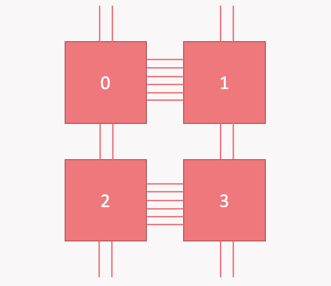
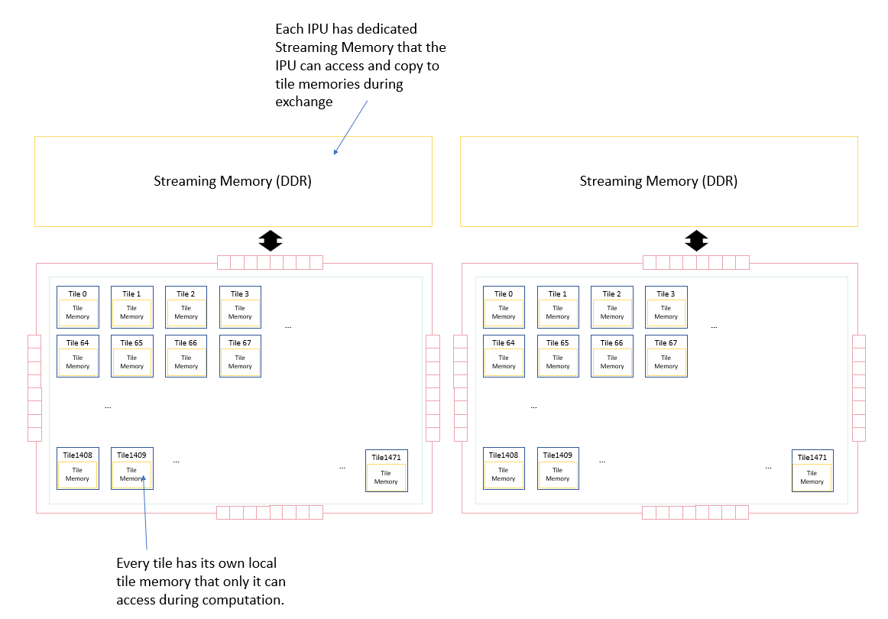
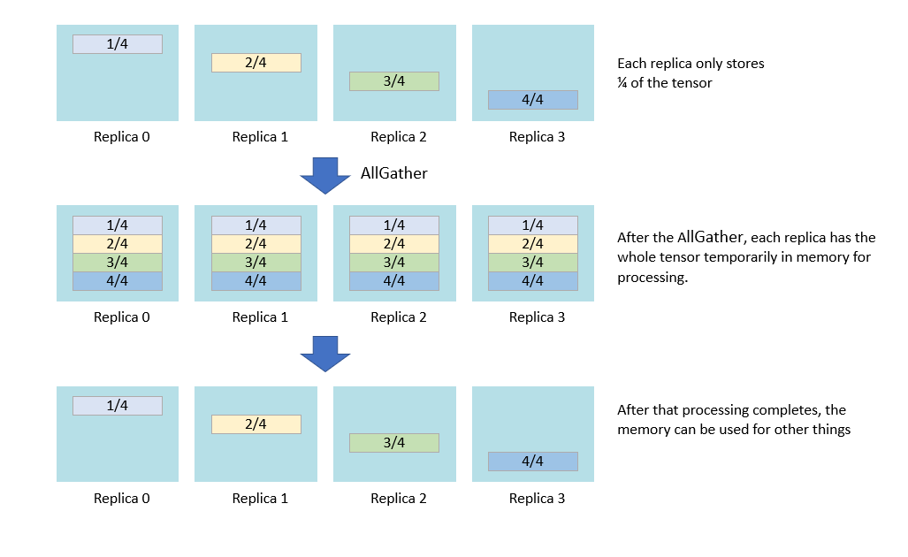
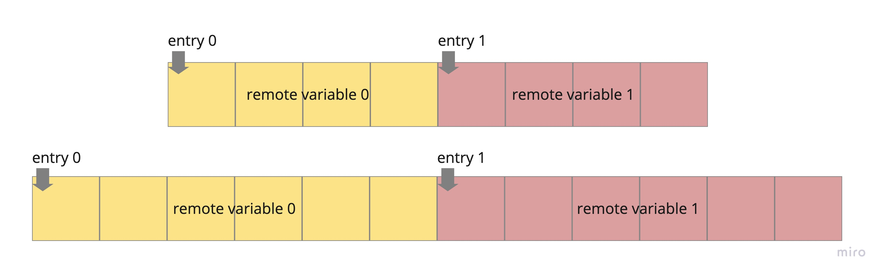
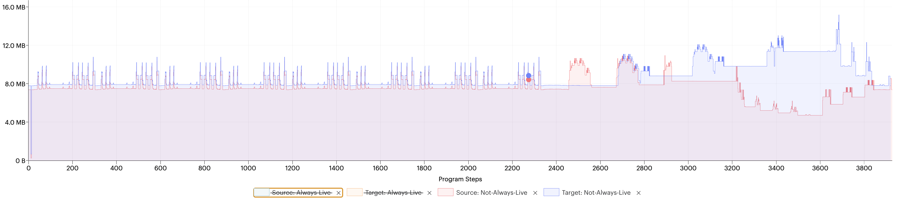
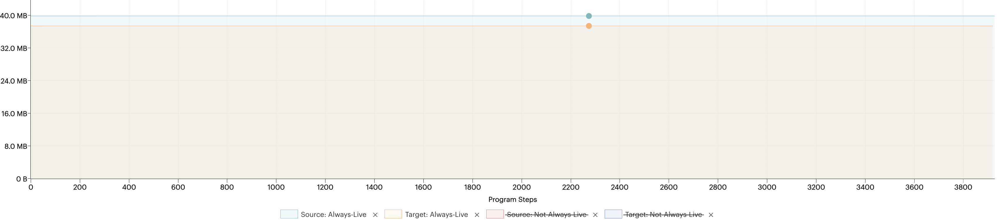
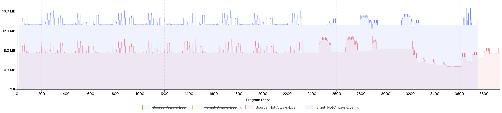
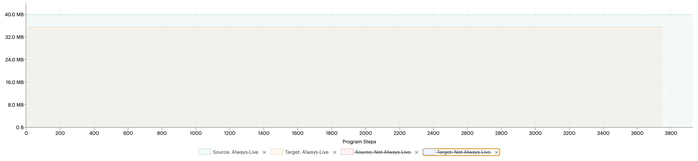

# IPU Hardware
In this tutorial we are going to show two techniques that can be used to address memory issues.
Before entering into the topic, we suggest you read the [IPU hardware overview](https://docs.graphcore.ai/projects/ipu-programmers-guide/en/latest/about_ipu.html). Here we just give a very short overiew 

The building blocks for IPU pods are IPU-machines, which are systems of 4 connected IPUs.

Each IPU has 10 **IPU-links** to connect to other IPUs. Multiple links can connect two IPUs, in which case the data transfer is faster between these IPU with respect to others. 
In the M2000 machine, for example, the basic IPU machine has the following structure


**Figure 1:** *Ipu links*

When you use replication you don't select the IPUs to be used for replicas. Given the required number of IPUs, the best option is chosen automatically. 

The memory in an IPU-based machine is made up of **In-Processor-Memory** (SRAM) and **Streaming Memory**.

**Figure 2:** *IPU memory architecture*

The In-Processor-Memory is the IPU’s local **SRAM** and is splitted between tiles. Each tile only has direct access to code and data living in its local memory.

The Streaming Memory is made up of several **DDR memory chips** and is not directly accessible to the tiles. Reading/Storing data to the Streaming Memory happens through PCle links and Gateway links and is between `3x` and `20x` slower than chip-to-chip communication via IPU-links (depending on how many links are used).

Knowing that difference is important to understand how to efficiently apply the following techniques. 


# Replicated tensor sharding 

When we are using replication, some tensor may be the same across replicas. 
In order to save memory, we can choose to slice these tensors so that each replica only has ` num_elements/num_replicas` elements of the tensor, with extra padding if needed (read also [popART User Guide](https://docs.graphcore.ai/projects/popart-user-guide/en/latest/tensor_locations.html?highlight=replicated%20tensor%20sharding#replicated-tensor-sharding-rts)).

This technique is called [Replicated tensor sharding](https://docs.graphcore.ai/projects/ipu-programmers-guide/en/latest/algorithmic_techniques.html#replicated-tensor-sharding).

When the full tensors are required by the program you need to make use of `gather` collectives, hence sharding comes with extra communication cost. This communication will happen through IPU-links. 

However, the full tensor is no longer in memory for the entire lifetime of the program, so the memory gain can be significant.

When we implement data parallelism with replication, a lot of variables are duplicated: each replica is using exactly the same weights, and also the optimizer state is the same: these are typically good candidates for RTS.

As we will see in the next section, RTS is commonly used together with remote variables because it can amortise its cost.


**Figure 3:** *Replicated Tensor Sharding*

## RTS in popxl.addons
Sharded tensors can be identified since they have a `meta_shape`, representing the shape of the original tensor. Hence, you can know if a tensor is sharded by checking if `t.meta_shape` is not `None`.
The `shape` of a sharded tensor is always flattened, `(num_elements/num_replicas, )`.

When you create a layer with the ```addons.Module``` class, you can specify sharded inputs with the
`module.add_replica_sharded_variable_input` method. This works just like `module.add_variable_input` but expects sharded variables. Even if the input is sharded, the full tensor will be initialised.

An analogue function `add_replica_sharded_variable_input`  is available in `addons.variable_factory` if you are using `VariableFactories` outside the module context.

To shard a tensor either `remote_replica_sharded_variable` or `ops.collectives.replicated_reduce_scatter(..., configure_output_for_replicated_tensor_sharding=True)` can be used. We will see both examples in this tutorial.

Another useful function when dealing with sharded tensors is ```addons.rts.replica_sharded_spec(t: popxl.Tensor, threshold: int)```. If the tensor has more elements than threshold, it returns the appropriate `TensorSpec` for the shard.

# Remote Variables
When the IPU memory is insufficient the Streaming Memory can be used to store data remotely.
Given the low bandwidth for remote transfers, the ideal use case for the streaming memory is data which does not require frequent access, so that the communication cost can be amortised. 
Moreover, we can **shard** remote variables to make the transfer faster: in a way sharding a remote variable is equivalent to perform part of the transfer using the IPU-Links instead of remote transfer, increasing the effective bandwith. 

To store data in the Streaming Memory we make use of **remote buffers** and **remote variables** (see also [remote variables in popxl](https://docs.pages.gitlab.sourcevertex.net/docs/docs/PopART/popxl-user-guide/2.5.0/remote.html))

A remote buffer represents a data array in the Streaming Memory, and a remote variable is a tensor whose data is located at a certain position in a remote buffer (hence, in the Streaming Memory). 

A remote variable is always linked to a specific **entry** in a buffer, which tells where the variable starts.

The image below shows two different buffers, both with 2 entries but created with different tensor shapes, the first with a flat count of 4 elements and the second with 6. 

**Figure 4:** *Remote buffers, entries and remote variables*

When you want to actually use a remote variable in your program, you need to load the data from the buffer to the IPU.

In `popxl`, remote buffers are created via ```remote_buffer(tensor_shape, tensor_dtype, entries)```.
The remote buffer can be thought as an array of the given `tensor_dtype`  with `tensor_total_elements * entries` slots. 

Each entry corresponds to a different variable: indeed, when you create a remote variable you have to specify the buffer and the entry number: ```popxl.remote_variable(data, buffer, entry_number)```.

Likewise, when you load or store a variable from a buffer you have to tell the entry number, because in this way we know where data for the variable is located
```python
loaded_x = ops.remote_load(buffer, entry_number)
ops.remote_store(buffer, entry_number, loaded_x)
```
## Remote variables in popxl.addons
In `popxl.addons` you typically manage `NamedTensors`. 

You can create `NamedRemoteBuffers` for a set of `NamedTensors` or `NamedVariableFactories` with 

```python
addons.named_buffers(named_tensors, entries, sharded_threshold)
addons.named_variable_buffers(named_factories, entries, sharded_threshold)
```
respectively.
These functions create a buffer for each VariableFactory or NamedTensors, with the specified entries.

If the shape is so that `nelms >= sharded_threshold`, a replica sharded RemoteBuffer will be created instead.
`entries > 1` can be useful if you have multiple instances of the same layer. You can create buffers for all the layer variables specifying `entries = layers_copies` and access variables for the different copies by changing the entry number. 

Once you have the `NamedRemoteBuffers` you can create a graph to load variables with  
```python
load_graph, names = load_remote_graph(buffers: NamedRemoteBuffers, entries: int = 1)
```
This function returns a `GraphWithNamedArgs` and a list of names.
The resulting graph has no named inputs and it requires the `entry_index` as input: `load_graph.call(0)` returns the remote variable stored at index 0 in the remote buffer.
The `entries` argument can be provided to resize each buffer as needed, in case you want to enlarge your buffer.

Likewise, you can create a graph to store variables into buffer after you have updated them with 
```python
store_graph = store_remote_graph(buffers: NamedRemoteBuffers, entries: int = 1)
```
The graph has a named input for each buffer provided, with the tensor shape of the buffer.  It needs to be bound before calling it.
```python
store_graph.bind(w0).call(0)
```

In the example below we illustrate these concepts.

```python
import sys
import argparse
from functools import partial
from typing import Mapping, Optional
import torch
import numpy as np
from time import time
from dataclasses import dataclass
import popxl
import popxl_addons as addons
import popxl.ops as ops
from typing import Union, Dict
from popxl_addons.graph import GraphWithNamedArgs
from popxl_addons.named_tensors import NamedTensors
from popxl_addons.variable_factory import NamedVariableFactories
from popxl_addons.rts import replica_sharded_spec

class Add(addons.Module): 
    def build(self, x: popxl.Tensor):
        w = self.add_variable_input("weight", partial(np.ones, x.shape), x.dtype)
        x = popxl.ops.add(w, x)
        return x


ir = popxl.Ir()
with ir.main_graph, popxl.in_sequence(True):
    # ----- Create a single add graph -----
    data = np.ones((5,), dtype = np.float32)
    x = popxl.constant(data)
    facts, graph = Add().create_graph(x.spec)
    
    # ----- Create NamedRemoteBuffers -----
    # We use two entries since we want to have two copies of the layer,
    # referencing different remote variables
    entries = 2
    buffers = addons.named_variable_buffers(facts, entries=entries, sharded_threshold=10)# no shards
    
    # ----- Create create load and store graphs -----
    load_graph, names = addons.load_remote_graph(buffers,entries=entries)
    store_graph = addons.store_remote_graph(buffers,entries=entries)

    print(load_graph.print_schedule())
    print(store_graph.print_schedule())
    
    # ----- Initialise remote variables, both entries -----
    remote_vars_0 = facts.init_remote(buffers,0)
    remote_vars_1 = facts.init_remote(buffers,1)
    
    # ----- Load remote variables  -----
    w_loaded_0, = load_graph.call(0)
    w_loaded_1, = load_graph.call(1)

    # out streams to get the value back
    w0_initial_d2h = addons.host_store(w_loaded_0) # expected output (all elements equal): 1
    w1_initial_d2h = addons.host_store(w_loaded_1) # expected output (all elements equal): 1

    # ----- Bind and call  -----
    w_named_tensors_0 =  NamedTensors.pack(names, (w_loaded_0,))
    w_named_tensors_1 =  NamedTensors.pack(names, (w_loaded_1,))
    
    bound_add_0 = graph.bind(w_named_tensors_0) # bind to first set of variables
    bound_add_1 = graph.bind(w_named_tensors_1) # bind to second set of variables
    
    x0, = bound_add_0.call(x)
    x1, = bound_add_1.call(x)

    # out stream to get the value back
    x0_d2h = addons.host_store(x0) # expected output (all elements equal): 1+1 = 2
    x1_d2h = addons.host_store(x1) # expected output (all elements equal): 1+1 = 2

    # ----- Modify weights  -----
    update_val = np.full((5,), 1.0, dtype = np.float32)

    updater0 = popxl.constant(update_val) # now first layer has w = 2
    updater1 = popxl.constant(2*update_val) # now second layer has w = 3

    w_loaded_0 += updater0
    w_loaded_1 += updater1
    
    # store the new weights into buffer
    store_graph.bind(w_named_tensors_0).call(0)
    store_graph.bind(w_named_tensors_1).call(1)

    #load again and check that the buffer contains the updated value
    w_loaded_0, = load_graph.call(0)
    x0_new, = bound_add_0.call(x)
    w_loaded_1, = load_graph.call(1)
    x1_new, = bound_add_1.call(x)

    # out stream to get the value back
    w0_after_d2h = addons.host_store(w_loaded_0) # expected output (all elements equal): 2
    x0_new_d2h = addons.host_store(x0_new) # expected output (all elements equal): 1+2 = 3
    w1_after_d2h = addons.host_store(w_loaded_1) # expected output (all elements equal): 3
    x1_new_d2h = addons.host_store(x1_new) # expected output (all elements equal): 1+3 = 4

with popxl.Session(ir,'ipu_hw') as session:
  outputs = session.run()

print("initial values")
print("\t w_0: ", outputs[w0_initial_d2h])
print("\t output0: ", outputs[x0_d2h])
print("\t w_1: ", outputs[w1_initial_d2h])
print("\t output1: ", outputs[x1_d2h])

print("updated values")
print("\t w_0: ", outputs[w0_after_d2h])
print("\t output0: ", outputs[x0_new_d2h])
print("\t w_1: ", outputs[w1_after_d2h])
print("\t output1: ", outputs[x1_new_d2h])
```

```
Graph : load_remote_subgraph(1)
  (%1) -> (%3) {
    Init.101 () -> (%2 [(5,) float32])
    RemoteLoad.102 (%2 [(5,) float32], %1 [() int32]) -> (%3 [(5,) float32])
  }
Graph : store_remote_subgraph(2)
  (%1, weight=%2) -> () {
    RemoteStore.103 (%2 [(5,) float32], %1 [() int32]) -> ()
  }
initial values
	 w_0:  [1. 1. 1. 1. 1.]
	 output0:  [2. 2. 2. 2. 2.]
	 w_1:  [1. 1. 1. 1. 1.]
	 output1:  [2. 2. 2. 2. 2.]
updated values
	 w_0:  [2. 2. 2. 2. 2.]
	 output0:  [3. 3. 3. 3. 3.]
	 w_1:  [3. 3. 3. 3. 3.]
	 output1:  [4. 4. 4. 4. 4.]
```

# Mnist with off-chip optimizer state

The starting point for this tutorial will be the [Data parallelism tutorial](https://github.com/graphcore/popxl-addons/tree/master/examples/mnist/2_Data_Parallelism).

We are going to modify the optimizer so that its state is stored remotely in the Streaming Memory:
- The Adam optimizer now uses `add_replica_sharded_variable_input` when the variable is sharded.
- We introduce a `remote_step` function that creates remote buffers and all the graphs (load/store + optimizer graph), load the state, call the optimizer and store the new state to the buffer. 

Since the optimizer state is sharded, also its inputs must be sharded: ```def build(self, var: popxl.TensorByRef, grad: popxl.Tensor, ...)``` `var` and `grad` must be sharded too.
This implies few things:

- When the optimizer is created, we need to specify sharded specs: 
```python
optimizer.create_graph(
                          replica_sharded_spec(var, threshold=sharded_threshold),
                          replica_sharded_spec(grad, threshold=sharded_threshold), 
                          ...
                          )
```
- When the optimizer is called, `var` and `grad` must be sharded tensors. To achieve this, we need to:
    - Reduce gradients across replicas with `reduce_replica_sharded_graph`. This becomes a `replicated_reduce_scatter(..., configure_output_for_replicated_tensor_sharding=True)` for tensors exceeding the provided threshold
    - Shard the variables using `local` operation in `replicated_reduce_scatter`. This just means splitting the tensor. 
    ``` python
    for name, v in variables.named_tensors.items():
        ir = popxl.gcg().ir
        if v.nelms >= opts.sharded_threshold and v.nelms % ir.replication_factor == 0:
            shard = ops.collectives.replicated_reduce_scatter(
                v, op='local', configure_output_for_replicated_tensor_sharding=True)
     ```
- The optimizer is called with the shards as inputs: `opt.call(sharded_var, sharded_grad)`. After the call, `sharded_var` is updated with the new value since is a `TensorByRef` input. However, we need to collect all the updated shards with `ops.collectives.replicated_all_gather` and copy the new value in the original full tensor with `ops.var_updates.copy_var_update_`.
```python
for name, v in enumerate(sharded_vars.tensors):
    if v.meta_shape:
        # we need to gather the updated shards
        v_full = ops.collectives.replicated_all_gather(v)
        # and copy the updated value in the original full tensor
        ops.var_updates.copy_var_update_(variables.tensors[name], v_full)
```

## Memory and performance
You can play around with the `sharded_threshold` option to see how the throughput, execution time and memory usage change. 
With `data_parallelism = 4`, `gradient_accumulation = 8`, `micro_batch_size = 8`, 
we evaluated the throghput for `100` iterations in the cases of no-sharding, sharding only the optimizer state related to fc1.weight, sharding all optimizer variables related to the weights but not those releated to biases, and sharding all the state. 
The result is that best throughput and execution time is reached with all tensors sharded, in agreement with the observation that the IPU-links are significantly faster and hence sharding is convenient when using remote variables. With respect to the case with on-chip optimizer (you can run the [Data parallelism tutorial](https://github.com/graphcore/popxl-addons/tree/master/examples/mnist/2_Data_Parallelism) with the same parameters) we have lost something in throughput and speed, but this was expected.

Case | Threshold | Throughput (samples/s) | Execution time (s)
 --- | --------- | ---------------------- | ----------------- 
no sharding | 1e10 (inf) | 43418.9 | 0.0059
only state related to fc1.weight | 262145 | 50909.2 | 0.0050
all state related to weights | 1024 | 67403.4 | 0.0038
all state | 512 | 72570.0 | 0.0035
**on-chip optimizer** | | 107418.9 | 0.0024

To analyze the memory usage we can use [Popvision Graph Analyser](https://docs.graphcore.ai/projects/graph-analyser-userguide/en/latest/user-guide.html?highlight=Rx%2FTx#execution-view-options).

Sharding or not sharding does not make a big difference in our case:



**Figure 4:** *Target: off chip optimizer state, non sharded, Source: off chip optimizer state, all sharded*

Hence, we compare the sharded remote optimizer program, which is the one with higher throughput, with the on-chip program.



**Figure 5:** *Target: on chip optimizer state, Source: off chip optimizer state, sharded*

The off-chip version of the program requires more always live memory: this reflects a bigger code size. However, the not always live memory usage, where we can find variables, is lower. 
A lot more information is available in the profile, and you can compare specific variables and operations in the two cases.

To generate your own profiles, comment out the code related to validation in the `mnist.py` script and run it with
```
POPLAR_ENGINE_OPTIONS='{"autoReport.all":"true"}' python3 mnist.py
```

You can try to generate your own and see how everything scales with the model size, the number of replicas, ... 