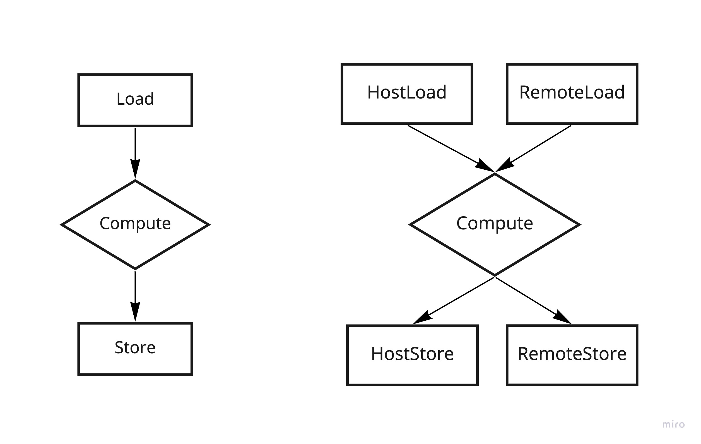
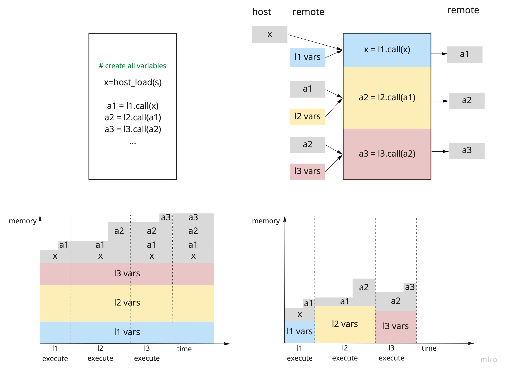
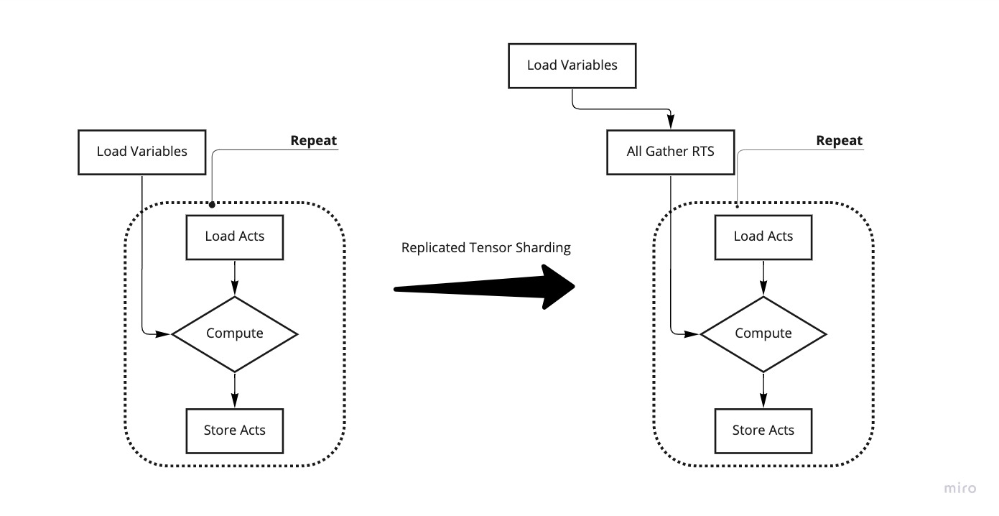
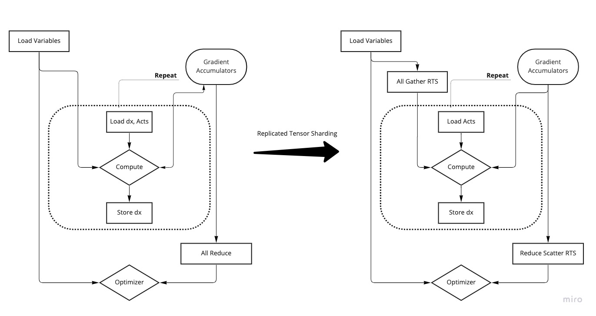
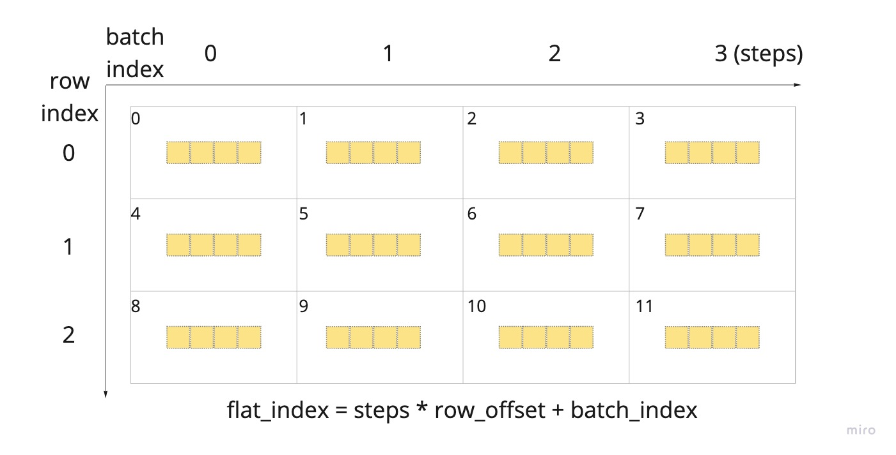
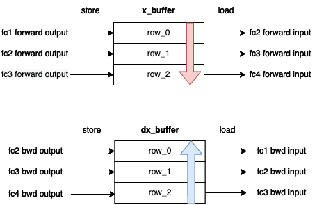

# Phased Execution

Phased execution is an execution strategy that can be applied when the whole model is too big to fit in memory.

When you design a phased execution strategy, you partition the graph execution into **phases**. Variables and required activations for the phases are stored remotely in the streaming memory.
When the phase needs to be executed, variables and needed activations are loaded. This way tensors are only required to be alive during the phase execution.

<figure>

<figcaption> <b>Fig 1: </b> Execution diagram for a phase, consisting of <code> load </code> -> <code>compute</code> -> <code>store</code> steps. Load and store operations can be towards the streaming memory (remote load/store) or towards the host.
</figcaption>
</figure>

<figure>

<figcaption> <b>Fig 2: </b> On the right, non phased model: all variables and activations are alive for the whole duration of the program.  On the left, an example of phased execution with three phases, corresponding to the three layers of the model. Variables and activations for each phase are stored remotely and only loaded when the layer needs to execute. The lower section of the image shows the difference in memory occupation (just indicative) due to reduced liveness of variables and activations. Backward is not shown.
</figcaption>
</figure>

# Batch serialisation

The building block of phased execution is the phase graph, made of its `load` -> `compute` -> `store` steps. 
Typically phased execution is implemented together with gradient accumulation technique and the phase graph needs to be repeated in the gradient accumulation loop. 
The naive implementation of the gradient accumulation loop would look like:

```python
for _ in range(gradient_accumulation_steps):
    ...
    # ---- Layer A ----
    
    a_vs = load() # load layer specific variables 
    a_xs = load() # load inputs
    a_ys = a.bind(vs).call(xs) 
    store(a_ys) # store activations

    # ---- Layer B ----
    
    b_vs = load() # load layer specific variables 
    b_xs = load() # load inputs, that are the previous layer activations a_ys
    b_ys = b.bind(vs).call(b_xs)
    store(b_ys) # store activations
    ...
optimiser
```

However, variables are updated only after the gradient accumulation loop. Hence, they can be loaded once for all to reduce the number of load operations and the communication cost.
A better loop for phased execution is 

```python
...
# ---- Layer A ----

a_vs = load() # load layer specific variables 
for _ in range(gradient_accumulation_steps):
    a_xs = load() # load inputs
    a_ys = a.bind(vs).call(a_xs)
    store(a_ys) # store activations. Note that we now need to store activations for each step!

# Layer B
b_vs = load() # load layer specific variables 
for _ in range(gradient_accumulation_steps):
    b_xs = load() # load inputs, that are previous layer activations for the same GA step, a_ys[step]
    b_ys = b.bind(vs).call(b_xs)
    store(b_ys) # store activations
...
optimiser
```
Batch serialisation is a transfrom that takes a graph and build a `repeat` loop with this kind of structure:
```
load variables for the phase
repeat(load activations - compute - store activations)
... additional things (for example, optimizer)
```

Since phased execution makes use of remote buffers, you should use RTS to amortise the communication overhead, in which case you need to include the appropriate collective operations in the picture.

Images below illustrate batch serialised phased execution.
<figure>

<figcaption> <b>Fig 3: </b> A batch serialised forward phase. On the right, RTS is included.
</figcaption>
</figure>

<figure>

<figcaption> <b>Fig 4: </b> A batch serialised backward phase. On the right, RTS is included.
</figcaption>
</figure>

## Batch serialisation in popxl.addons
It should be clear from the above code snippets that in batch serialisation we need to store activations for all steps.
This is reflected in the remote buffers structure. In the context of `popxl.addons` batch serialisation, it's useful to consider remote buffers as if they were matrices, with rows corresponding to different phases that can share the same buffer (they need to have the same graph) and `steps` columns corresponding to the batch indices. Underneath this logical layout, each element at a position defined by row and column has its own entry in the underlying `popxl` remote buffer, consisting of `rows * steps` entries.

<figure>

<figcaption> <b>Fig 5: </b> Remote buffer logical layout. Rows correspond to different phases that can share the same buffer (for example, when the phases are identical layers). Columns are the different batches, once for each gradient accumulation step. The entry index in the buffer is given by the <code> flat_index </code>.
</figcaption>
</figure>

You can create this kind of buffers with `batch_serial_buffer(t: popxl.Tensor, steps: int, rows: int = 1)`.

To build a batch serialised graph in `popxl.addons` you can use `batch_serialise(...)` and `batch_serialise_fwd_and_grad(...)`

```python
batch_serialise(
                    graph: GraphWithNamedArgs,
                    steps: int,
                    load_handles: Dict[popxl.Tensor, Union[popxl.HostToDeviceStream, RemoteBufferAndOffset]],
                    store_streams: Dict[popxl.Tensor, popxl.DeviceToHostStream],
                    store_buffers: Dict[popxl.Tensor, RemoteBufferAndOffset],
                    seed_input: Optional[popxl.Tensor] = None,
                    rows: int = 1,
                    io_mode: Literal['compute', 'io', 'io_overlapped'] = 'io'
                ) -> BatchSerialResult
```
You need to provide the `graph` which you want to repeat for `steps` times.

Also, you need to tell how the inputs for the graph are loaded, providing a dictionary between each input and a host to device stream (if loaded from the host) or a `RemoteBufferAndOffset` which is just a `tuple` of a buffer and a row offset to access it.
For example, if you created a buffer with 
```python
x_buffer = batch_serial_buffer(first_layer_output, steps=opts.gradient_accumulation, rows=3)
```
you can then use it as a `load handle` for next layers:
```python
layer2_bs = batch_serialise(layer2, steps, {layer2.graph.inputs[0] : (x_buffer,0)}, ...)
layer3_bs = batch_serialise(layer2, steps, {layer3.graph.inputs[0] : (x_buffer,1)}, ...)
layer4_bs = batch_serialise(layer2, steps, {layer4.graph.inputs[0] : (x_buffer,2)}, ...)
````
`(x_buffer,0)` is a `RemoteBufferWithOffset`, telling that `layer2` input should be loaded from the `x_buffer` first row. Likewise, `layer3.graph.inputs[0] : (x_buffer,1)` specifies that `layer3` input should be loaded from row one. 
As you can see, you don't have to worry about the batch dimension, you always just need to think about the row you want to access. Internally, the graph will access the correct column at each step.
If you don't provide a handle for a certain input, this will be an input of the batch serialised graph.

After specifying the `load_handles`, you can provide `store_streams` and `store_buffers`for the layer outputs. They are kept separate because sometimes you may want to use both: stream an output to the host and store it in a buffer.
Outputs that are not specified in `store_streams` or `store_buffers` are not outputs of the batch serialised graph.

If your layer requires a different seed each time it's executed (for example, if you are using dropout), you should provide that input as `seed_input` parameter. That way a new random seed will be generated for each iteration step and fed to the layer graph.

The `rows` parameter allows you to specify multiple rows.

When you call a batch serialised graph, the first input is the row offset to access remote buffers, as in
```python
bs_graph = batch_serialise(graph, ..., rows=2)
bs_graph.call(0) # access first row in the buffers
bs_graph.call(1) # access second row in the buffers
```

Finally, the `io_mode` parameter manages how to load/store tensors during the loop.
- `compute` uses the Compute tiles.
- `io` uses the IO tiles.
- `io_overlapped` uses the io tiles and builds the loop such that Compute and IO can execute at the same time.

The `io` and `io_overlapped` modes require some tiles to be reserved as IO tiles (read also [popart user guide](https://docs.graphcore.ai/projects/popart-user-guide/en/latest/overlap_io.html?highlight=io%20tiles#configuring-io-tiles)).
You can do that by specifying session options after creating the `ir`.
```python
session_opts = ir._pb_ir.getSessionOptions()
session_opts.numIOTiles = 32 
```

The `batch_serialise_fwd_and_grad` transform is very similar to the `batch_serialise` transform
```python
def batch_serialise_fwd_and_grad(
        forward_graph: GraphWithNamedArgs,
        gradient_graph: GraphWithNamedArgs,
        named_inputs_for_grad_graph: NamedTensors,
        steps: int,
        load_handles: Dict[popxl.Tensor, Union[popxl.HostToDeviceStream, RemoteBufferAndOffset]],
        store_streams: Dict[popxl.Tensor, popxl.DeviceToHostStream],
        store_buffers: Dict[popxl.Tensor, RemoteBufferAndOffset],
        seed_input: Optional[popxl.Tensor] = None,
        rows: int = 1,
        io_mode: Literal['compute', 'io', 'io_overlapped'] = 'io') -> Tuple[BatchSerialResult, BatchSerialResult]:
```
It applies batch serialisation to the both forward and backward graphs, ensuring that all inputs in the backward graph that derive from the forward are properly managed.
This means that:
- If there is a `store_buffer` for the tensor, this same buffer is used as a `load_handle` in the backward.
- If there is a `load_handle` for the tensor, this `load_handle` is used
- If the tensor is provided in `named_inputs_for_grad_graph`, the returned gradient graph will have this tensor as a named input and you will need to bind the graph to it. Typically, you want to use this parameter to provide the forward variables:
```python
fwd_vars = fwd_facts.init()
bwd_vars = bwd_facts.init() # gradient accumulators in autodiff_with_accum
bwd_vars.update(fwd_vars.copy())
batch_serialised_bwd.graph.bind(bwd_vars).call(0) 
```
- If the tensor is not provided in any of these ways, a new buffer is created for it, where the forward tensor will be stored.

The result of a batch serialisation transform is a `BatchSerialResult`, gathering the batch serialised `graph`, `store_buffers` and a  dictionary to remap tensors from the original graph to the transformed one.

# Mnist with phased execution and batch serialisation
In this tutorial we are going to implement a phased execution mnist example illustrating all these concepts.
We will use data parallelism, remote buffers and replicated tensor sharding. Hence, check out the previous tutorials on these topics: 
- [Data parallelism and gradient accumulation](../2_Data_Parallelism)
- [Remote variables and RTS](../4_Remote_Variables)

You may also want to have another look at outlining in the very [first tutorial](../0_Basic_Concepts).

Our network has 4 layers. We define 7 phases for training:
- fc1 forward
- fc2 forward
- fc3 forward
- output layer fwd + loss + output layer bwd 
- fc3 backward
- fc2 backward
- fc1 backward

Forward variables and optimizer state are stored remotely. 
We use a `Graphs` class to keep together the forward, backward, and optimizer graphs for the same module and easily deal with loading/storing/updating variables. 
We create three `Graphs` objects:
- one for `fc1`, corresponding to a `Linear` module. In `input_layer_batch_serialise`, we batch serialise the forward and backward graphs for this layer, using `batch_serialise_fwd_and_grad`.
- one for the inner layers,`fc2` and `fc3`, which are identical, corresponding to a `Linear` module with different input shape from the first one. Since they are identical, they share the same graph and they can use the same remote buffer for forward variables and optimizer state, but we need to specify `2` entries (the `Graphs` class has an `entries` parameter for this aim). In `layer_batch_serialise`, we batch serialise the forward and backward graphs, using `batch_serialise_fwd_and_grad`. We need to specify `rows=2` when using the transform, one row for each layer. 
- one corresponding to the `OutputLayerWithBwd` module. In this case, we don't have a backward graph: the forward graph already includes the backward. Hence, in `output_layer_batch_serialise`, we use the `batch_serialise` transform.

We also need two buffers to connect the phases, a `x_buffer` and a` dx_buffer` where each phase can read its inputs and store its outputs.
```python
x_buffer = batch_serial_buffer(
                               fc1.fwd.graph.outputs[0],
                               steps=opts.train.gradient_accumulation,
                               rows=num_inner_layers + 1
                               )
dx_buffer = batch_serial_buffer(
                                fc1.bwd.graph.inputs[0],
                                steps=opts.train.gradient_accumulation,
                                rows=num_inner_layers + 1
                                )
```
Each row in `x_buffer` corresponds to a forward phase excluding the last forward phase (which just reads from the buffer), and each row in `dx_buffer` correspond to a backward phase, excluding the last backward phase (which just reads from the buffer).

The first forward phase loads inputs from host, and store its output in the first row of the `x_buffer`.
Next forward phases load their inputs from the previous phase row, and store their output in their own row.
The output layer only reads from the buffer.

During backward, the order is reversed: the output layer stores its `dx` output into the last row, and next backward phases read their `dx` input from the next row  and store their `dx` output into their own row. The input layer only reads from the buffer.

The image below illustrates the concept
<figure>

<figcaption> <b>Fig 6: </b> Connecting phases together: x and dx buffers
</figcaption>
</figure>